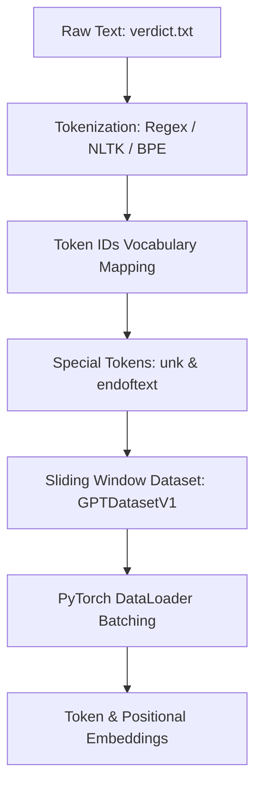

# Data Input Pipeline (`Data_Input_Pipeline.ipynb`)

This document provides a comprehensive, step-by-step breakdown of **`Data_Input_Pipeline.ipynb`**. It explains how raw text data is ingested, tokenized, transformed into dataset chunks using a sliding window, and converted into token and positional embeddings suitable for an LLM like GPT.

---

## 📌 Overview & Workflow

Before an LLM can process human language, raw text must undergo several transformation steps:



---

## 1. Reading Raw Text Data

The pipeline begins by reading a raw text file (`verdict.txt`, Edith Wharton's short story *"The Verdict"*).

```python
with open("verdict.txt", "r", encoding="utf-8") as f:
    raw_text = f.read()

print("Total character length:", len(raw_text))
```

- **Purpose**: Loads the document string into memory.
- **Output**: Total character count of the dataset.

---

## 2. Tokenization Strategies

Tokenization is the process of breaking continuous text into discrete units (tokens) such as words, punctuation, or subwords.

### Option A: Regular Expressions (`re.split`)

Simple regex splitting on spaces and common punctuation:

```python
import re

text = "Hello , world . this is a test"
result = re.split(r'(\s)', text)

# Advanced regex split on punctuation, double hyphens, and whitespace:
preprocessed = re.split(r'([,.:;?_!"()\']|--|\s)', raw_text)
preprocessed = [item.strip() for item in preprocessed if item.strip()]
```

- **Explanation**: 
  - `([,.:;?_!"()\']|--|\s)` captures individual punctuation marks and double hyphens as separate tokens.
  - `item.strip()` removes empty strings resulting from split matches.

### Option B: NLTK Tokenizer

```python
from nltk.tokenize import word_tokenize

preprocessed1 = word_tokenize(raw_text)
```

---

## 3. Building a Vocabulary & Token-to-ID Mapping

To feed tokens into neural networks, each unique token is mapped to a unique integer ID.

```python
# Extract all unique tokens and sort them alphabetically
all_words = sorted(set(preprocessed))
vocab_size = len(all_words)

# Create token-to-integer dictionary mapping
vocab = {token: integer for integer, token in enumerate(all_words)}
```

### Implementing `SimpleTokenizerV1`

```python
class SimpleTokenizerV1:
    def __init__(self, vocab):
        self.str_to_int = vocab
        self.int_to_str = {i: s for s, i in vocab.items()}
        
    def encode(self, text):
        preprocessed = re.split(r'([,.:;?_!"()\']|--|\s)', text)
        preprocessed = [item.strip() for item in preprocessed if item.strip()]
        ids = [self.str_to_int[s] for s in preprocessed]
        return ids
        
    def decode(self, ids):
        text = " ".join([self.int_to_str[i] for i in ids])
        # Remove whitespace preceding punctuation marks
        text = re.sub(r'\s+([,.:;?_!"()\'])', r'\1', text)
        return text
```

#### Example Usage:
```python
tokenizer = SimpleTokenizerV1(vocab)
text = "You are a painter , you paint good pride"
ids = tokenizer.encode(text)
print("Encoded IDs:", ids)
print("Decoded Text:", tokenizer.decode(ids))
```

---

## 4. Handling Unknown Words & Special Tokens

A naive vocabulary fails when encountering out-of-vocabulary (OOV) words. We add context control tokens:
- `<|unk|>`: Represents unknown or out-of-vocabulary words.
- `<|endoftext|>`: Marks document/text boundaries.

```python
all_tokens = sorted(list(set(preprocessed)))
all_tokens.extend(["<|endoftext|>", "<|unk|>"])
vocab = {token: integer for integer, token in enumerate(all_tokens)}
```

### Enhanced `SimpleTokenizerV1` with `<|unk|>` Fallback

```python
class SimpleTokenizerV1:
    def __init__(self, vocab):
        self.str_to_int = vocab
        self.int_to_str = {i: s for s, i in vocab.items()}

    def encode(self, text):
        preprocessed = re.split(r'([,.:;?_!"()\']|--|\s)', text)
        preprocessed = [item.strip() for item in preprocessed if item.strip()]
        preprocessed = [
            item if item in self.str_to_int else "<|unk|>"
            for item in preprocessed
        ]
        ids = [self.str_to_int[s] for s in preprocessed]
        return ids

    def decode(self, ids):
        text = " ".join([self.int_to_str[i] for i in ids])
        text = re.sub(r'\s+([,.:;?_!"()\'])', r'\1', text)
        return text
```

---

## 5. Byte Pair Encoding (BPE) with `tiktoken`

In modern LLMs (such as GPT-2/GPT-3/GPT-4), **Byte Pair Encoding (BPE)** is used. BPE breaks words into subwords, allowing the tokenizer to handle any unknown word without relying on `<|unk|>`.

```python
import tiktoken

# Load GPT-2 BPE tokenizer encoding
tokenizer = tiktoken.get_encoding("gpt2")

text = "Hello world! Unknown words like subword tokenization work smoothly."
ids = tokenizer.encode(text, allowed_special={"<|endoftext|>"})
print("BPE Token IDs:", ids)
print("Decoded:", tokenizer.decode(ids))
```

- Vocabulary size of GPT-2 BPE: **50,257** tokens.

---

## 6. Data Sampling with Sliding Window (`GPTDatasetV1`)

To train an autoregressive language model, text sequences are converted into overlapping input ($x$) and target ($y$) token ID pairs where $y$ is shifted by 1 position relative to $x$.

```
Text tokens: [ 50,  51,  52,  53,  54,  55 ]
Context size = 4

Chunk 1:
Input (x)  : [ 50,  51,  52,  53 ]
Target (y) : [ 51,  52,  53,  54 ]

Chunk 2 (stride = 4):
Input (x)  : [ 54,  55, ... ]
```

### PyTorch `GPTDatasetV1` Implementation

```python
import torch
from torch.utils.data import Dataset, DataLoader

class GPTDatasetV1(Dataset):
    def __init__(self, txt, tokenizer, max_length, stride):
        self.input_ids = []
        self.target_ids = []
        
        # Tokenize the input text
        token_ids = tokenizer.encode(txt, allowed_special={"<|endoftext|>"})
        
        # Sliding window sequence creation
        for i in range(0, len(token_ids) - max_length, stride):
            input_chunk = token_ids[i : i + max_length]
            target_chunk = token_ids[i + 1 : i + max_length + 1]
            self.input_ids.append(torch.tensor(input_chunk))
            self.target_ids.append(torch.tensor(target_chunk))
            
    def __len__(self):
        return len(self.input_ids)
        
    def __getitem__(self, idx):
        return self.input_ids[idx], self.target_ids[idx]
```

### DataLoader Helper Function

```python
def create_dataloader_v1(txt, batch_size=2, max_length=256,
                         stride=128, shuffle=True, drop_last=True,
                         num_workers=0):
    tokenizer = tiktoken.get_encoding("gpt2")
    dataset = GPTDatasetV1(txt, tokenizer, max_length, stride)
    dataloader = DataLoader(
        dataset,
        batch_size=batch_size,
        shuffle=shuffle,
        drop_last=drop_last,
        num_workers=num_workers
    )
    return dataloader
```

---

## 7. Token and Positional Embeddings

Neural networks require continuous vector representations rather than discrete integer token IDs.

### Token Embeddings
Map token IDs to continuous $d_{\text{out}}$-dimensional vectors:
$$\mathbf{E}_{\text{token}} \in \mathbb{R}^{\text{vocab\_size} \times d_{\text{out}}}$$

```python
vocab_size = 50257
output_dim = 256

token_embedding_layer = torch.nn.Embedding(vocab_size, output_dim)
```

### Positional Embeddings
Since self-attention is permutation-invariant, positional embeddings add sequence position information:
$$\mathbf{E}_{\text{pos}} \in \mathbb{R}^{\text{context\_len} \times d_{\text{out}}}$$

```python
max_length = 4
pos_emb_layer = torch.nn.Embedding(max_length, output_dim)
pos_emb = pos_emb_layer(torch.arange(max_length))
```

### Combined Input Representation
The final input embedding is the element-wise sum of token embeddings and positional embeddings:
$$\mathbf{X}_{\text{final}} = \mathbf{E}_{\text{token}}(\mathbf{X}) + \mathbf{E}_{\text{pos}}(\text{positions})$$

```python
# Sample batch of token IDs from DataLoader (shape: [batch_size, max_length])
inputs, targets = next(iter(dataloader))

# Token Embeddings shape: [batch_size, max_length, output_dim]
token_embeddings = token_embedding_layer(inputs)

# Combined Embeddings shape: [batch_size, max_length, output_dim]
input_embeddings = token_embeddings + pos_emb
print("Final Input Embedding Shape:", input_embeddings.shape)
```

---

## 💡 Summary Key Takeaways

| Step | Module / Function | Output Dimension / Description |
|---|---|---|
| **Tokenization** | `tiktoken.get_encoding("gpt2")` | Subword integer IDs ($V = 50,257$) |
| **Dataset Sampling** | `GPTDatasetV1` | Pairs of input $x$ and target $y$ shifted by 1 |
| **Batch DataLoader** | `create_dataloader_v1` | Batches of shape `[batch_size, max_length]` |
| **Token Embeddings** | `torch.nn.Embedding` | Shape `[batch_size, max_length, d_out]` |
| **Positional Embeddings** | `torch.nn.Embedding` | Shape `[max_length, d_out]` |
| **Final Input Vector** | `token_embeddings + pos_emb` | Shape `[batch_size, max_length, d_out]` |
