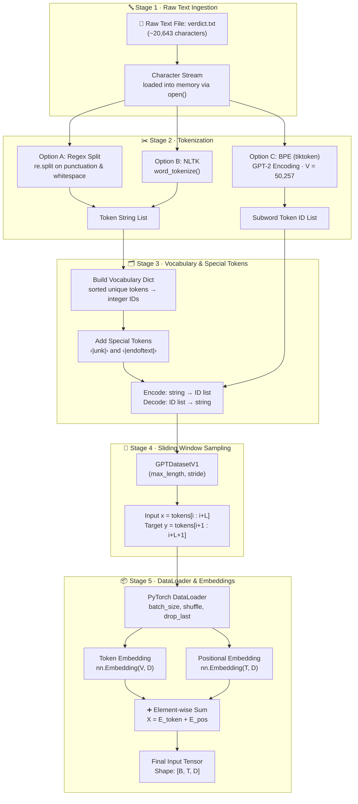
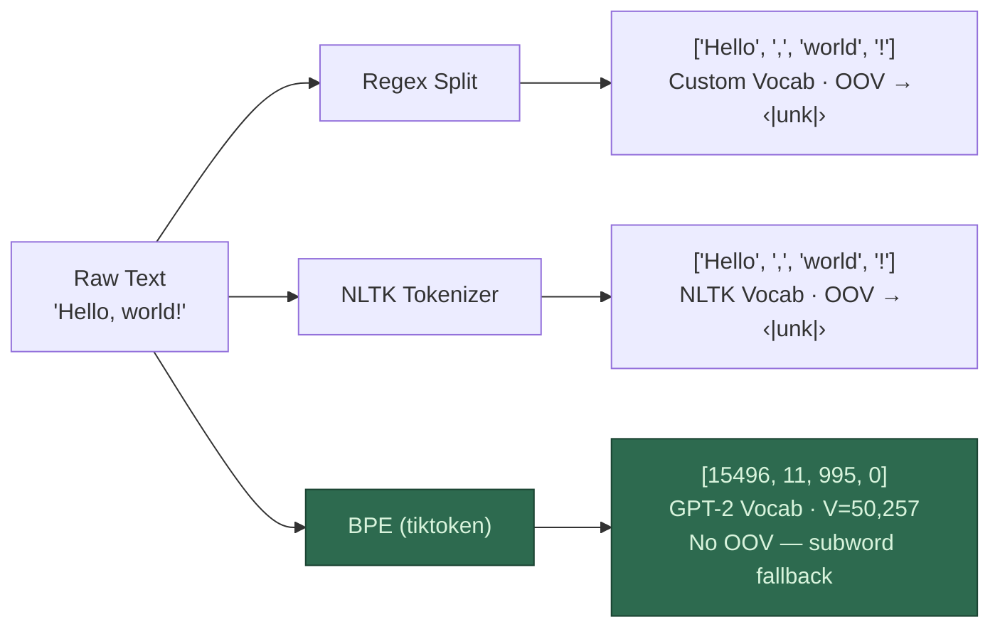
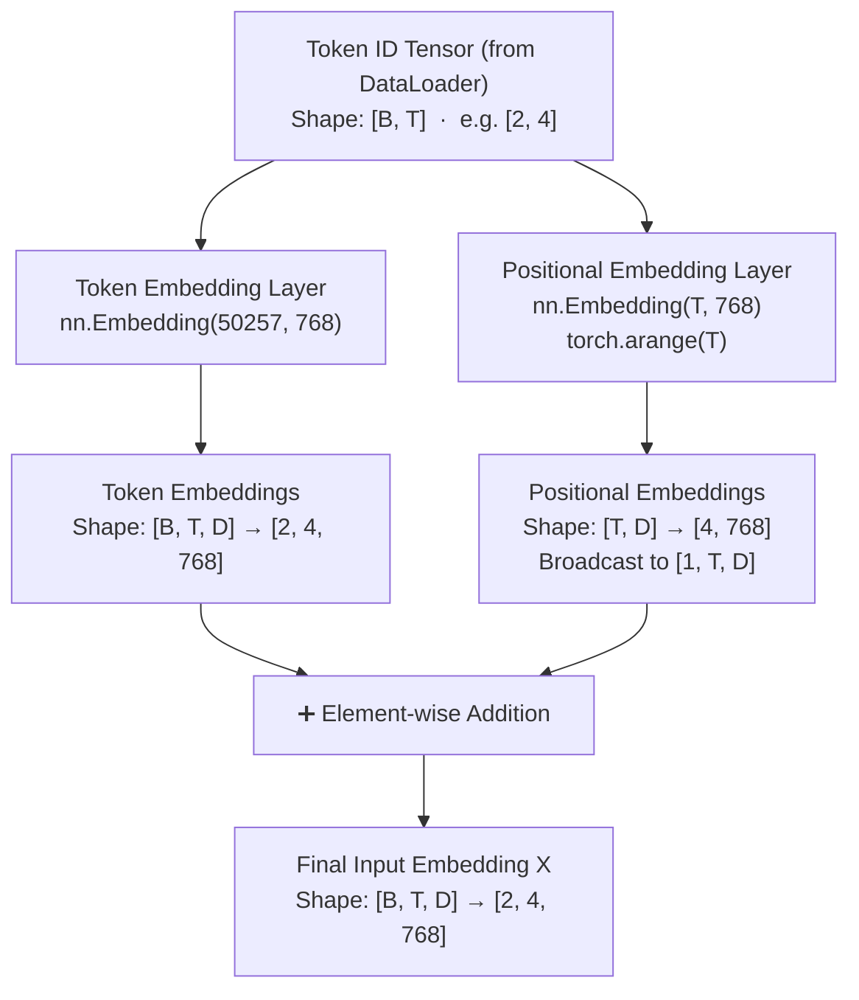

# 📊 Step 01 — Data Input Pipeline: Visual Workflow

> **Companion visualization for** [`Data_Input_Pipeline.ipynb`](file:///d:/projects/LLM/01_data_pipeline/Data_Input_Pipeline.ipynb) **and** [`Data_Input_Pipeline.md`](file:///d:/projects/LLM/01_data_pipeline/Data_Input_Pipeline.md)

---

## 1. End-to-End Data Pipeline Flowchart



---

## 2. Tokenization Strategy Comparison



---

## 3. Sliding Window Dataset Visualization

```
Token IDs:  [ 50,  51,  52,  53,  54,  55,  56,  57 ]
             ─────────────────────────────────────────
max_length = 4, stride = 1

┌─── Sample 1 ───┐
│ Input  x: [ 50, 51, 52, 53 ]     Target y: [ 51, 52, 53, 54 ]  │
└────────────────┘
    ┌─── Sample 2 ───┐
    │ Input  x: [ 51, 52, 53, 54 ]  Target y: [ 52, 53, 54, 55 ]  │
    └────────────────┘
        ┌─── Sample 3 ───┐
        │ Input  x: [ 52, 53, 54, 55 ]  Target y: [ 53, 54, 55, 56 ]  │
        └────────────────┘
            ┌─── Sample 4 ───┐
            │ Input  x: [ 53, 54, 55, 56 ]  Target y: [ 54, 55, 56, 57 ]  │
            └────────────────┘

Each sample:  x[i] → y[i] = x[i] shifted right by 1 position
```

---

## 4. Tensor Shape Transformation Pipeline



---

## 5. Embedding Summation Detail

```
Token Embedding Matrix E_token ∈ ℝ^{V × D}     (50,257 × 768)
                    │
                    ▼  Lookup by token IDs → [B, T, D]
┌───────────────────────────────────────────────┐
│  Batch 1, Token 1:  [0.12, -0.34, ..., 0.56] │  ← 768-dim vector
│  Batch 1, Token 2:  [0.78,  0.23, ..., -0.11]│
│  Batch 1, Token 3:  ...                       │
│  Batch 1, Token 4:  ...                       │
│  ─────────────────────────────────────────── │
│  Batch 2, Token 1:  ...                       │
│  ...                                          │
└───────────────────────────────────────────────┘

                    +

Positional Embedding Matrix E_pos ∈ ℝ^{T × D}  (4 × 768)
┌───────────────────────────────────────────────┐
│  Position 0:  [0.01,  0.05, ..., -0.03]       │  ← same for every batch
│  Position 1:  [0.08, -0.02, ...,  0.14]       │
│  Position 2:  ...                              │
│  Position 3:  ...                              │
└───────────────────────────────────────────────┘

                    =

Final Input X ∈ ℝ^{B × T × D}                   [2, 4, 768]
        → Ready for Attention layers
```

---

## 6. Summary Shape Table

| Stage | Component | Input Shape | Output Shape |
|:---:|---|:---:|:---:|
| 1 | Raw Text File | — | String (20,643 chars) |
| 2 | BPE Tokenizer (`tiktoken`) | String | Integer ID List (~5,145 IDs) |
| 3 | `GPTDatasetV1` Sliding Window | ID List | $(x, y)$ pairs, each `[T]` |
| 4 | `DataLoader` Batching | `[T]` pairs | `[B, T]` tensors |
| 5 | Token Embedding `nn.Embedding(V, D)` | `[B, T]` | `[B, T, D]` |
| 6 | Positional Embedding `nn.Embedding(T, D)` | `[T]` | `[T, D]` → broadcast `[1, T, D]` |
| 7 | Element-wise Sum `tok_emb + pos_emb` | `[B, T, D]` + `[1, T, D]` | **`[B, T, D]`** |
