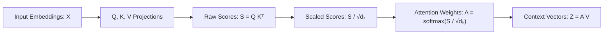

# Attention Mechanism (`Attention_Mechanism.ipynb`)

This document provides an in-depth breakdown of **`Attention_Mechanism.ipynb`**. It covers the mathematical formulation, intuition, step-by-step code implementation, and PyTorch module encapsulation of self-attention mechanisms in Large Language Models (LLMs).

---

## 📌 Mathematical Foundations of Self-Attention

Self-attention allows each token in an input sequence to dynamically score and aggregate information from all other tokens in the sequence.



---

## 1. Simplified Self-Attention (Without Trainable Weights)

In the simplest form of self-attention, input embeddings themselves act as queries, keys, and values.

### Input Data Definition

```python
import torch

# Clean tensor printing configuration
torch.set_printoptions(precision=4, sci_mode=False, edgeitems=5)

# Example input token embeddings (6 tokens, 3-dimensional embeddings)
inputs = torch.tensor(
    [[0.43, 0.15, 0.89],  # Token 1 ("Your")
     [0.55, 0.87, 0.66],  # Token 2 ("journey")
     [0.57, 0.85, 0.64],  # Token 3 ("starts")
     [0.22, 0.58, 0.33],  # Token 4 ("with")
     [0.77, 0.25, 0.10],  # Token 5 ("one")
     [0.05, 0.80, 0.55]]  # Token 6 ("step")
)
```

### Step 1: Dot-Product Similarity for a Single Query Token

Select Token 2 ($x^{(2)} = [0.55, 0.87, 0.66]$) as the query token:

```python
query = inputs[1]  # 2nd input token

# Calculate unnormalized attention scores (similarity with all tokens)
attention_score = torch.empty(inputs.shape[0])
for i, x in enumerate(inputs):
    attention_score[i] = torch.dot(x, query)

print("Attention Scores for query x^(2):", attention_score)
```

### Step 2: Normalization using Softmax

Attention scores must sum to 1 to form a probability distribution.

```python
def softmax(x):
    return torch.exp(x) / torch.exp(x).sum(dim=0)

attention_weights = torch.softmax(attention_score, dim=0)
print("Attention Weights:", attention_weights)
print("Sum of Weights:", attention_weights.sum())  # 1.0000
```

$$\alpha_{2, i} = \frac{\exp(x^{(2)} \cdot x^{(i)})}{\sum_{j=1}^{T} \exp(x^{(2)} \cdot x^{(j)})}$$

### Step 3: Computing the Context Vector

The context vector $z^{(2)}$ for Token 2 is a weighted sum of all input vectors using attention weights $\alpha_{2, i}$:

$$z^{(2)} = \sum_{i=1}^{T} \alpha_{2, i} x^{(i)}$$

```python
context_vector = torch.zeros(query.shape)
for i, x in enumerate(inputs):
    context_vector += attention_weights[i] * x

print("Context Vector for Token 2:", context_vector)
```

---

## 2. Vectorized Self-Attention for All Tokens (Matrix Multiplication)

Instead of looping over tokens, we can compute attention scores and context vectors for all tokens simultaneously using matrix operations.

```python
# Unnormalized attention score matrix S = X @ Xᵀ (shape: [6, 6])
attn_score = inputs @ inputs.T

# Softmax across rows (dim=1)
attn_weights = torch.softmax(attn_score, dim=1)

# Context vectors Z = A @ X (shape: [6, 3])
context_vec = attn_weights @ inputs
print("Context Vector Matrix Z:\n", context_vec)
```

---

## 3. Self-Attention with Trainable QKV Weights

In standard Transformer architectures, self-attention projects inputs into three separate vector spaces:
- **Query ($Q$)**: Represents what the current token is searching for.
- **Key ($K$)**: Represents what information the token offers.
- **Value ($V$)**: Represents the content vector to be aggregated.

$$Q = X W_q, \quad K = X W_k, \quad V = X W_v$$

```python
x2 = inputs[1]
din = inputs.shape[1]  # Input dimension = 3
dout = 2               # Output embedding dimension = 2

torch.manual_seed(123)

# Trainable weight parameters
w_query = torch.nn.Parameter(torch.rand(din, dout))
w_key   = torch.nn.Parameter(torch.rand(din, dout))
w_value = torch.nn.Parameter(torch.rand(din, dout))
```

### Computing Q, K, V Matrices

```python
# Project all input tokens
queries = inputs @ w_query # Shape: [6, 2]
keys    = inputs @ w_key   # Shape: [6, 2]
values  = inputs @ w_value # Shape: [6, 2]
```

### Scaled Dot-Product Attention

To prevent dot products from growing excessively large in high dimensions, attention scores are scaled by $\frac{1}{\sqrt{d_k}}$:

$$S = \frac{Q K^\top}{\sqrt{d_k}}$$

$$\mathbf{A} = \text{softmax}(S, \text{dim}=-1)$$

$$\mathbf{Z} = \mathbf{A} V$$

```python
d_k = keys.shape[1]  # 2

# Raw attention score matrix Q @ K.T
attn_scores = queries @ keys.T

# Scaled Softmax Attention Weights
attn_weights = torch.softmax(attn_scores / (d_k ** 0.5), dim=-1)

# Output Context Vectors
context_vec = attn_weights @ values
print("Context Vectors Shape:", context_vec.shape)  # [6, 2]
```

---

## 4. PyTorch Module Implementations

### Implementation 1: `SelfAttention_v1` using `nn.Parameter`

```python
import torch.nn as nn

class SelfAttention_v1(nn.Module):
    def __init__(self, din, dout):
        super().__init__()
        self.d_k = dout
        self.w_query = nn.Parameter(torch.rand(din, dout))
        self.w_key   = nn.Parameter(torch.rand(din, dout))
        self.w_value = nn.Parameter(torch.rand(din, dout))

    def forward(self, x):
        queries = x @ self.w_query
        keys    = x @ self.w_key
        values  = x @ self.w_value

        attn_scores  = queries @ keys.T
        attn_weights = torch.softmax(attn_scores / (self.d_k ** 0.5), dim=-1)
        context_vec  = attn_weights @ values
        return context_vec
```

### Implementation 2: `SelfAttention_v2` using `nn.Linear`

Using `nn.Linear` automatically handles weight initialization and optionally includes bias terms:

```python
class SelfAttention_v2(nn.Module):
    def __init__(self, d_in, d_out, qkv_bias=False):
        super().__init__()
        self.d_k = d_out
        self.W_query = nn.Linear(d_in, d_out, bias=qkv_bias)
        self.W_key   = nn.Linear(d_in, d_out, bias=qkv_bias)
        self.W_value = nn.Linear(d_in, d_out, bias=qkv_bias)

    def forward(self, x):
        queries = self.W_query(x)
        keys    = self.W_key(x)
        values  = self.W_value(x)

        attn_scores  = queries @ keys.T
        attn_weights = torch.softmax(attn_scores / (self.d_k ** 0.5), dim=-1)
        context_vec  = attn_weights @ values
        return context_vec
```

#### Example Usage:
```python
torch.manual_seed(789)
sa_v2 = SelfAttention_v2(d_in=3, d_out=2)
context_vectors = sa_v2(inputs)
print("SelfAttention_v2 Output Vectors:\n", context_vectors)
```

---

## 💡 Summary Comparison Table

| Variant | QKV Projections | Scale Factor | PyTorch Abstraction | Use Case |
|---|---|---|---|---|
| **Simple Self-Attention** | None ($X$ direct) | None | Pure PyTorch Ops | Conceptual baseline |
| **Vectorized Self-Attention** | None ($X$ direct) | None | Matrix Multiplication (`@`) | Fast full-sequence compute |
| **Trainable QKV (`v1`)** | `nn.Parameter` | $\frac{1}{\sqrt{d_k}}$ | `nn.Parameter(torch.rand)` | Custom explicit weight matrices |
| **Trainable QKV (`v2`)** | `nn.Linear` | $\frac{1}{\sqrt{d_k}}$ | `nn.Linear(d_in, d_out)` | Production PyTorch standard |
