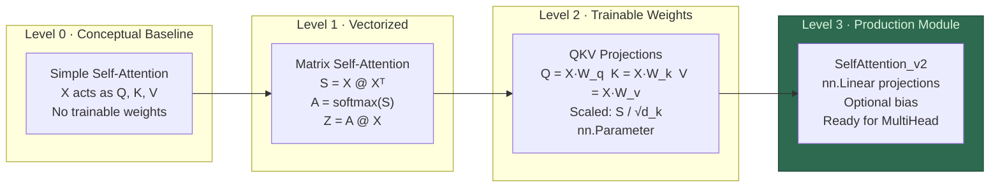
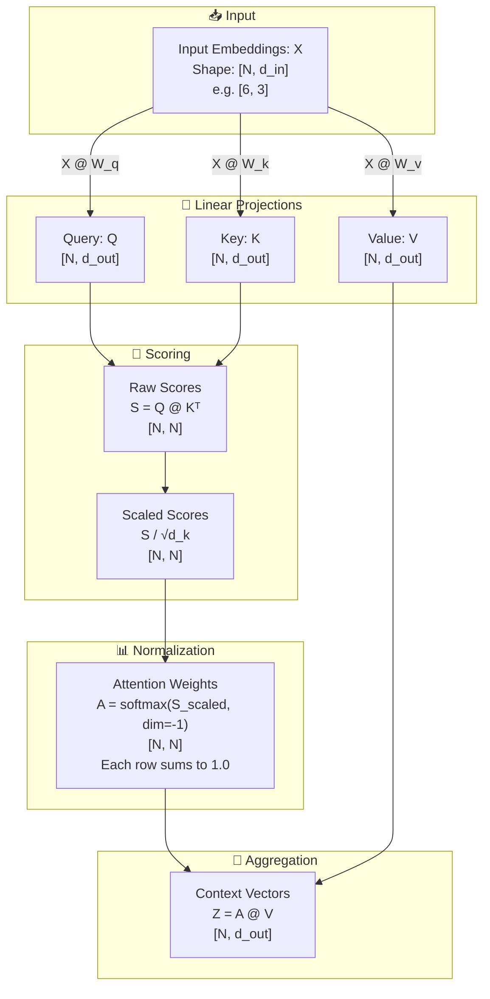
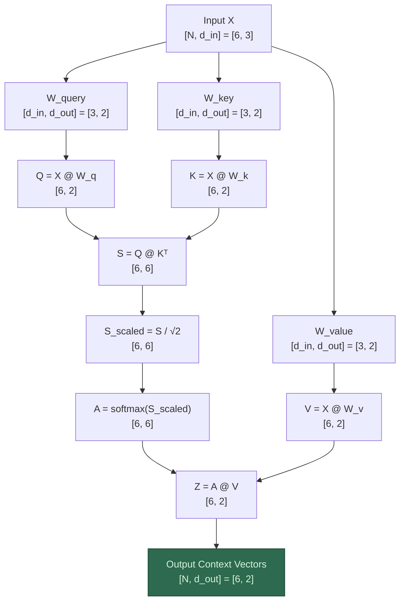
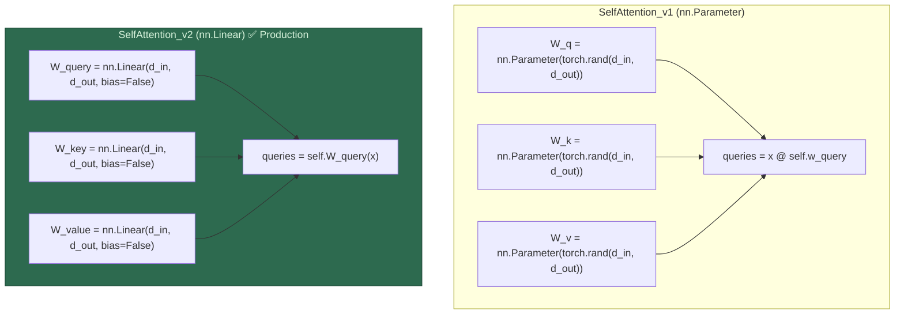

# 📊 Step 02 — Attention Mechanism: Visual Workflow

> **Companion visualization for** [`Attention_Mechanism.ipynb`](file:///d:/projects/LLM/02_attention_mechanism/Attention_Mechanism.ipynb) **and** [`Attention_Mechanism.md`](file:///d:/projects/LLM/02_attention_mechanism/Attention_Mechanism.md)

---

## 1. Self-Attention Evolution Roadmap



---

## 2. Scaled Dot-Product Self-Attention (Full Workflow)



---

## 3. Single-Token Attention Walkthrough (Token 2 as Query)

```
6 Tokens, 3-dim embeddings:

Token 1 ("Your")    = [0.43, 0.15, 0.89]
Token 2 ("journey") = [0.55, 0.87, 0.66]  ← Query
Token 3 ("starts")  = [0.57, 0.85, 0.64]
Token 4 ("with")    = [0.22, 0.58, 0.33]
Token 5 ("one")     = [0.77, 0.25, 0.10]
Token 6 ("step")    = [0.05, 0.80, 0.55]

Step 1: Dot-Product Similarity (query = Token 2)
┌──────────────────────────────────────────────────────┐
│  score(2,1) = dot([0.55,0.87,0.66], [0.43,0.15,0.89])  │
│  score(2,2) = dot([0.55,0.87,0.66], [0.55,0.87,0.66])  │  ← self-similarity (highest)
│  score(2,3) = dot([0.55,0.87,0.66], [0.57,0.85,0.64])  │
│  ...                                                    │
└──────────────────────────────────────────────────────┘

Step 2: Softmax Normalization
┌──────────────────────────────────────────────────────┐
│  α₂ = softmax([score₁, score₂, ..., score₆])         │
│  Sum of weights = 1.0                                 │
└──────────────────────────────────────────────────────┘

Step 3: Weighted Aggregation
┌──────────────────────────────────────────────────────┐
│  z₂ = α₂₁·x₁ + α₂₂·x₂ + α₂₃·x₃ + ... + α₂₆·x₆    │
│  → Context vector for Token 2: [3-dim vector]         │
└──────────────────────────────────────────────────────┘
```

---

## 4. Attention Weight Matrix Heatmap (Conceptual)

```
                    Keys (K)
            Token1  Token2  Token3  Token4  Token5  Token6
         ┌────────────────────────────────────────────────┐
Token1   │  0.22    0.18    0.17    0.14    0.16    0.13  │  → sum = 1.0
Token2   │  0.15    0.21    0.20    0.14    0.13    0.17  │  → sum = 1.0
Queries  Token3   │  0.16    0.20    0.20    0.14    0.14    0.16  │  → sum = 1.0
(Q)      Token4   │  0.14    0.18    0.18    0.16    0.15    0.19  │  → sum = 1.0
Token5   │  0.19    0.16    0.16    0.13    0.22    0.14  │  → sum = 1.0
Token6   │  0.13    0.19    0.19    0.16    0.13    0.20  │  → sum = 1.0
         └────────────────────────────────────────────────┘
                    Attention Weight Matrix A [N, N]

Each cell A[i,j] = "how much Token i attends to Token j"
Higher value = stronger influence from Token j on Token i's output
```

---

## 5. Tensor Shape Transformation Pipeline



---

## 6. PyTorch Module Comparison



---

## 7. Why Scale by $\frac{1}{\sqrt{d_k}}$?

```
Without Scaling (d_k = 64):
┌──────────────────────────────────────────────────┐
│ Raw scores S = Q @ Kᵀ  can have large magnitudes │
│ e.g. values like [45.2, 38.1, 2.3, 0.1, ...]    │
│                                                   │
│ softmax([45.2, 38.1, 2.3, 0.1, ...])             │
│ = [0.999, 0.001, 0.000, 0.000, ...]              │
│ → Nearly one-hot! Gradients vanish for all but 1  │
└──────────────────────────────────────────────────┘

With Scaling (÷ √64 = ÷ 8):
┌──────────────────────────────────────────────────┐
│ Scaled scores S / √d_k                            │
│ e.g. values like [5.65, 4.76, 0.29, 0.01, ...]  │
│                                                   │
│ softmax([5.65, 4.76, 0.29, 0.01, ...])           │
│ = [0.55, 0.37, 0.04, 0.03, ...]                  │
│ → Smooth distribution! Healthy gradient flow      │
└──────────────────────────────────────────────────┘
```

---

## 8. Summary Shape Table

| Step | Operation | Shape |
|:---:|---|:---:|
| Input | Token Embeddings $X$ | `[N, d_in]` |
| Projection | $Q = X W_q$ | `[N, d_out]` |
| Projection | $K = X W_k$ | `[N, d_out]` |
| Projection | $V = X W_v$ | `[N, d_out]` |
| Raw Scores | $S = Q K^\top$ | `[N, N]` |
| Scaled Scores | $S / \sqrt{d_k}$ | `[N, N]` |
| Attention Weights | $A = \text{softmax}(S_{\text{scaled}})$ | `[N, N]` |
| Context Vectors | $Z = A V$ | **`[N, d_out]`** |
