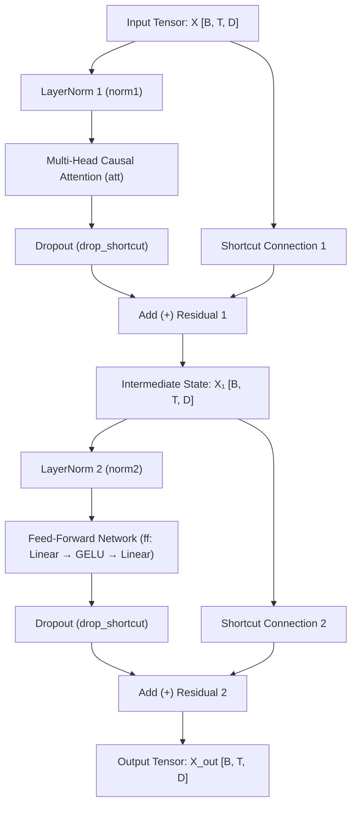

# Transformer Block Architecture (`Transformer_Block.md`)

This document provides an in-depth breakdown of the **Transformer Block** architecture as implemented in [`code/gpt_model.py`](file:///d:/projects/LLM/code/gpt_model.py) and [`code/Multiheadattention.py`](file:///d:/projects/LLM/code/Multiheadattention.py).

The Transformer Block is the central repeating building block of Decoder-Only Large Language Models (such as GPT-2, GPT-3, and LLaMA). Stacking $N$ transformer blocks enables the model to extract complex sequential context, model long-range semantic dependencies, and generate fluent text.

---

## 📌 Architectural Flow & Block Structure

Modern GPT models utilize a **Pre-Layer Normalization (Pre-LN)** design. Normalization is applied *before* entering the Multi-Head Attention and Feed-Forward sub-layers, and residual (shortcut) connections bypass each sub-layer.



---

## 1. Sub-Component Deep Dives

A Transformer Block integrates four primary sub-components:
1. **Layer Normalization (`LayerNorm`)**
2. **Multi-Head Causal Self-Attention (`MultiHeadAttention`)**
3. **Gaussian Error Linear Unit (`GELU`) Activation**
4. **Position-wise Feed-Forward Expansion Network (`FeedForward`)**

---

### 1.1 Layer Normalization (`LayerNorm`)

Layer Normalization standardizes feature activations across the embedding dimension $D$ for each token independently, stabilizing activations and preventing exploding/vanishing gradients during deep model training.

#### Mathematical Formulation

Given an input feature vector $x \in \mathbb{R}^D$:

$$\mu = \frac{1}{D} \sum_{i=1}^{D} x_i, \quad \sigma^2 = \frac{1}{D} \sum_{i=1}^{D} (x_i - \mu)^2$$

$$\hat{x} = \frac{x - \mu}{\sqrt{\sigma^2 + \epsilon}}$$

$$y = \gamma \odot \hat{x} + \beta$$

Where:
- $\epsilon = 10^{-5}$ is a small constant for numerical stability.
- $\gamma$ (`scale`) and $\beta$ (`shift`) are learnable parameters initialized to $1$ and $0$, respectively.

#### PyTorch Implementation

```python
class LayerNorm(nn.Module):
    def __init__(self, emb_dim):
        super().__init__()
        self.eps = 1e-5
        self.scale = nn.Parameter(torch.ones(emb_dim))   # Learnable scale (gamma)
        self.shift = nn.Parameter(torch.zeros(emb_dim))  # Learnable shift (beta)

    def forward(self, x):
        mean = x.mean(dim=-1, keepdim=True)
        var = x.var(dim=-1, keepdim=True, unbiased=False)
        norm_x = (x - mean) / torch.sqrt(var + self.eps)
        return self.scale * norm_x + self.shift
```

> [!NOTE]
> **Pre-LN vs Post-LN Architecture**: Original Transformer papers (Vaswani et al.) used Post-LN (normalization after residual addition). Modern GPT architectures use **Pre-LN** (normalization before sub-layers), which allows gradients to flow unimpeded directly down the residual branch during backpropagation.

---

### 1.2 Multi-Head Causal Self-Attention (`MultiHeadAttention`)

Multi-Head Attention enables tokens to concurrently attend to information from different representation subspaces across multiple attention heads.

#### Mathematical Steps & Matrix Projections

1. **Query, Key, Value Linear Projections**:
   $$Q = X W_Q, \quad K = X W_K, \quad V = X W_V$$
   Where $W_Q, W_K, W_V \in \mathbb{R}^{D \times D}$.

2. **Head Splitting & Transposition**:
   Projected matrices are reshaped from $[B, T, D]$ to $[B, T, H, d_k]$ and transposed to $[B, H, T, d_k]$, where $H$ is the number of heads and $d_k = D / H$ is the head dimension.

3. **Causal Masking & Scaled Dot-Product Attention**:
   Upper-triangular causal mask $M$ sets future position attention logits to $-\infty$:
   $$\text{Attention}(Q, K, V) = \text{softmax}\left(\frac{Q K^T}{\sqrt{d_k}} + M\right) V$$

4. **Head Re-combination & Output Projection**:
   Heads are concatenated back into $[B, T, D]$ and passed through output linear projection $W_O \in \mathbb{R}^{D \times D}$.

#### PyTorch Implementation

```python
class MultiHeadAttention(nn.Module):
    def __init__(self, d_in, d_out, context_length, dropout, num_heads, qkv_bias=False):
        super().__init__()
        assert d_out % num_heads == 0, "d_out must be divisible by num_heads"

        self.d_out = d_out
        self.num_heads = num_heads
        self.head_dim = d_out // num_heads

        self.W_query = nn.Linear(d_in, d_out, bias=qkv_bias)
        self.W_key = nn.Linear(d_in, d_out, bias=qkv_bias)
        self.W_value = nn.Linear(d_in, d_out, bias=qkv_bias)
        self.out_proj = nn.Linear(d_out, d_out)
        self.dropout = nn.Dropout(dropout)
        self.register_buffer("mask", torch.triu(torch.ones(context_length, context_length), diagonal=1))

    def forward(self, x):
        b, num_tokens, d_in = x.shape

        keys = self.W_key(x).view(b, num_tokens, self.num_heads, self.head_dim).transpose(1, 2)
        queries = self.W_query(x).view(b, num_tokens, self.num_heads, self.head_dim).transpose(1, 2)
        values = self.W_value(x).view(b, num_tokens, self.num_heads, self.head_dim).transpose(1, 2)

        attn_scores = queries @ keys.transpose(2, 3)
        mask_bool = self.mask.bool()[:num_tokens, :num_tokens]
        attn_scores.masked_fill_(mask_bool, -torch.inf)

        attn_weights = torch.softmax(attn_scores / (keys.shape[-1]**0.5), dim=-1)
        attn_weights = self.dropout(attn_weights)

        context_vec = (attn_weights @ values).transpose(1, 2).reshape(b, num_tokens, self.d_out)
        return self.out_proj(context_vec)
```

---

### 1.3 Gaussian Error Linear Unit (`GELU`) Activation

Instead of traditional ReLU ($\max(0, x)$), GPT models use **GELU**, a smooth, non-linear activation function that weights inputs by their probability under a Gaussian distribution.

#### Mathematical Approximation Formula

$$\text{GELU}(x) \approx 0.5 \cdot x \cdot \left(1 + \tanh\left(\sqrt{\frac{2}{\pi}} \left(x + 0.044715 \cdot x^3\right)\right)\right)$$

```python
class GELU(nn.Module):
    def __init__(self):
        super().__init__()

    def forward(self, x):
        return 0.5 * x * (1 + torch.tanh(
            torch.sqrt(torch.tensor(2.0 / torch.pi)) *
            (x + 0.044715 * torch.pow(x, 3))
        ))
```

> [!TIP]
> **Why GELU?** Unlike ReLU, GELU is non-monotonic and continuous everywhere. It provides small, non-zero gradients for negative inputs, preventing "dead neuron" issues in deep networks.

---

### 1.4 Position-Wise Feed-Forward Network (`FeedForward`)

The Feed-Forward Network (FFN) processes token representations individually position by position. It expands the embedding dimension by a factor of $4$ before contracting back to $D$.

#### Mathematical Formulation

$$\text{FFN}(x) = \text{GELU}(x W_1 + b_1) W_2 + b_2$$

Where:
- $W_1 \in \mathbb{R}^{D \times 4D}$
- $W_2 \in \mathbb{R}^{4D \times D}$

```python
class FeedForward(nn.Module):
    def __init__(self, cfg):
        super().__init__()
        self.layers = nn.Sequential(
            nn.Linear(cfg["emb_dim"], 4 * cfg["emb_dim"]),  # Expansion layer: D -> 4D
            GELU(),                                        # Non-linear activation
            nn.Linear(4 * cfg["emb_dim"], cfg["emb_dim"]),  # Contraction layer: 4D -> D
        )

    def forward(self, x):
        return self.layers(x)
```

---

## 2. Complete `TransformerBlock` Class

Combining `LayerNorm`, `MultiHeadAttention`, `FeedForward`, and residual shortcut connections:

```python
class TransformerBlock(nn.Module):
    def __init__(self, cfg):
        super().__init__()
        self.att = MultiHeadAttention(
            d_in=cfg["emb_dim"],
            d_out=cfg["emb_dim"],
            context_length=cfg["context_length"],
            num_heads=cfg["n_heads"],
            dropout=cfg["drop_rate"],
            qkv_bias=cfg["qkv_bias"]
        )
        self.ff = FeedForward(cfg)
        self.norm1 = LayerNorm(cfg["emb_dim"])
        self.norm2 = LayerNorm(cfg["emb_dim"])
        self.drop_shortcut = nn.Dropout(cfg["drop_rate"])

    def forward(self, x):
        # 1. Attention Block with Residual Connection
        shortcut = x
        x = self.norm1(x)
        x = self.att(x)
        x = self.drop_shortcut(x)
        x = x + shortcut  # Residual addition

        # 2. Feed-Forward Block with Residual Connection
        shortcut = x
        x = self.norm2(x)
        x = self.ff(x)
        x = self.drop_shortcut(x)
        x = x + shortcut  # Residual addition

        return x
```

---

## 3. Step-by-Step Tensor Shape Transformations

One key design feature of the `TransformerBlock` is **Shape Invariance**:

$$\text{Input Shape } [B, T, D] \xrightarrow{\quad\text{TransformerBlock}\quad} \text{Output Shape } [B, T, D]$$

Below is the shape transformation trace for a batch of sequence tokens ($B=2, T=1024, D=768, H=12, d_k=64$):

| Layer / Step | Input Tensor Shape | Operation | Output Tensor Shape |
|---|---|---|---|
| **Input $X$** | $[2, 1024, 768]$ | Block Input | $[2, 1024, 768]$ |
| **`norm1`** | $[2, 1024, 768]$ | Layer Normalization | $[2, 1024, 768]$ |
| **`att` (Q, K, V)** | $[2, 1024, 768]$ | Linear Projections ($W_Q, W_K, W_V$) | $[2, 1024, 768]$ each |
| **Head Split** | $[2, 1024, 768]$ | Reshape & Transpose $(B, H, T, d_k)$ | $[2, 12, 1024, 64]$ |
| **Attention Softmax** | $[2, 12, 1024, 64]$ | $(Q K^T / \sqrt{d_k}) + M$ Softmax | $[2, 12, 1024, 1024]$ weights |
| **Context Assembly** | $[2, 12, 1024, 1024] \times [2, 12, 1024, 64]$ | MatMul with $V$, reshape to $[B, T, D]$ | $[2, 1024, 768]$ |
| **`out_proj`** | $[2, 1024, 768]$ | Linear Output Projection $W_O$ | $[2, 1024, 768]$ |
| **Residual Add 1** | $[2, 1024, 768] + [2, 1024, 768]$ | Element-wise Addition $X + \text{Attn}(X)$ | $[2, 1024, 768]$ |
| **`norm2`** | $[2, 1024, 768]$ | Layer Normalization | $[2, 1024, 768]$ |
| **`ff` Linear 1** | $[2, 1024, 768]$ | Dimension Expansion ($D \to 4D$) | $[2, 1024, 3072]$ |
| **`ff` GELU** | $[2, 1024, 3072]$ | GELU Activation | $[2, 1024, 3072]$ |
| **`ff` Linear 2** | $[2, 1024, 3072]$ | Dimension Contraction ($4D \to D$) | $[2, 1024, 768]$ |
| **Residual Add 2** | $[2, 1024, 768] + [2, 1024, 768]$ | Element-wise Addition $X_1 + \text{FFN}(X_1)$ | $[2, 1024, 768]$ |

---

## 🔑 Transformer Block Component Summary

| Component | Class Name | Function & Purpose | Hidden Dimension Transformation |
|---|---|---|---|
| **Layer Normalization** | `LayerNorm` | Normalizes features across $D$ dimension to mean 0, variance 1. | $[B, T, D] \to [B, T, D]$ |
| **Multi-Head Attention** | `MultiHeadAttention` | Computes scaled causal self-attention across $H$ parallel heads. | $[B, T, D] \to [B, H, T, d_k] \to [B, T, D]$ |
| **GELU Activation** | `GELU` | Smooth non-linear activation weighting inputs by Gaussian distribution. | $[B, T, 4D] \to [B, T, 4D]$ |
| **Feed-Forward Expansion** | `FeedForward` | Position-wise 2-layer MLP expanding hidden representations. | $[B, T, D] \to [B, T, 4D] \to [B, T, D]$ |
| **Residual Connections** | `x + sublayer(x)` | Adds input shortcut directly to sub-layer output to preserve gradient flow. | $[B, T, D] \to [B, T, D]$ |
