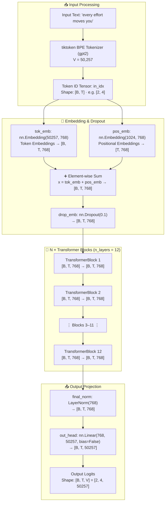
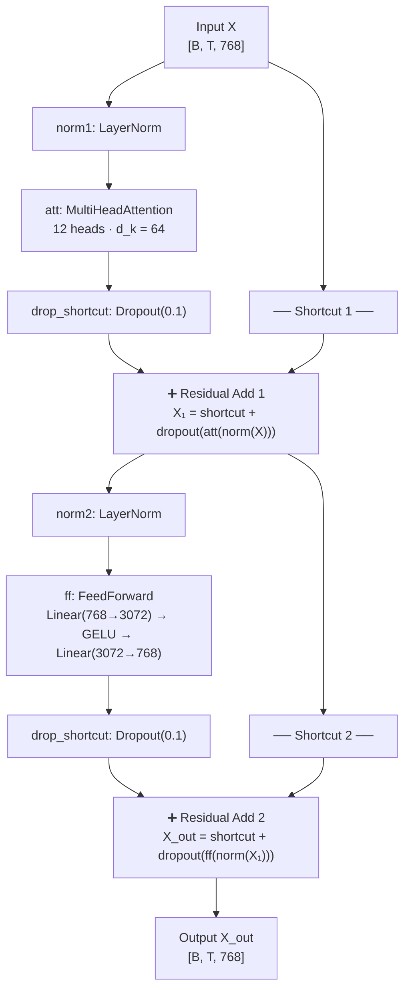
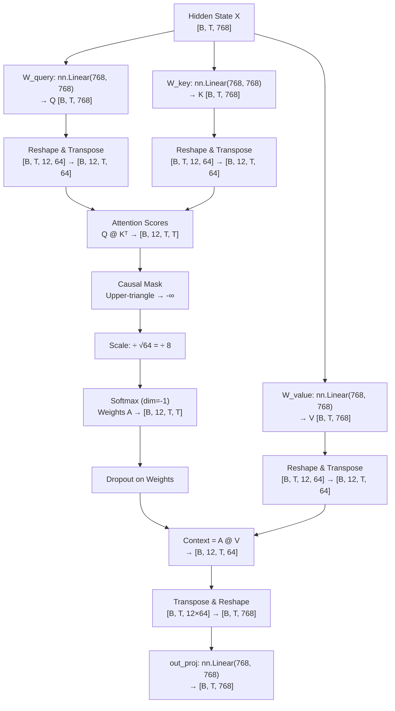
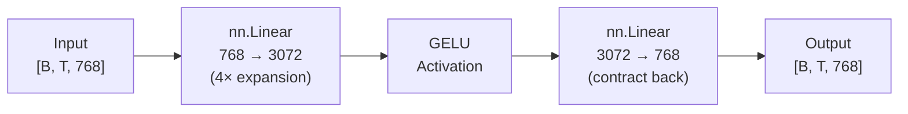
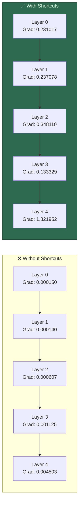
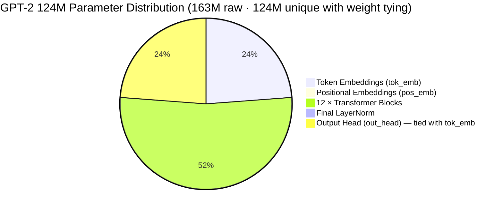

# 📊 Step 03 — GPT Architecture: Visual Workflow

> **Companion visualization for** [`GPT_Model.ipynb`](file:///d:/projects/LLM/03_gpt_architecture/GPT_Model.ipynb), [`GPT_Model.md`](file:///d:/projects/LLM/03_gpt_architecture/GPT_Model.md), **and** [`Transformer_Block.md`](file:///d:/projects/LLM/03_gpt_architecture/Transformer_Block.md)

---

## 1. Full GPTModel Macro-Architecture



---

## 2. Single Transformer Block (Pre-LN Design)



---

## 3. Multi-Head Attention (Head Split → Score → Merge)



---

## 4. Causal Mask Visualization

```
Causal (Autoregressive) Mask for T = 6 tokens:

         Key positions →
          t₁    t₂    t₃    t₄    t₅    t₆
     ┌─────────────────────────────────────────┐
 t₁  │  ✅    ❌    ❌    ❌    ❌    ❌   │   Token 1 sees only itself
 t₂  │  ✅    ✅    ❌    ❌    ❌    ❌   │   Token 2 sees tokens 1–2
Query t₃  │  ✅    ✅    ✅    ❌    ❌    ❌   │   Token 3 sees tokens 1–3
pos.  t₄  │  ✅    ✅    ✅    ✅    ❌    ❌   │   Token 4 sees tokens 1–4
 t₅  │  ✅    ✅    ✅    ✅    ✅    ❌   │   Token 5 sees tokens 1–5
 t₆  │  ✅    ✅    ✅    ✅    ✅    ✅   │   Token 6 sees tokens 1–6
     └─────────────────────────────────────────┘

✅ = Attend (score retained)
❌ = Masked (score set to -∞, softmax → 0.0)

Implementation: torch.triu(torch.ones(T, T), diagonal=1)
→ Upper triangle = 1 → masked_fill with -inf
```

---

## 5. Feed-Forward Network Expansion & Contraction



```
Dimension trace through FeedForward:

    [B, T, 768]  ──Linear──▶  [B, T, 3072]  ──GELU──▶  [B, T, 3072]  ──Linear──▶  [B, T, 768]
         D                       4 × D                      4 × D                      D
```

---

## 6. GELU vs ReLU Activation

```
                          GELU vs ReLU Comparison
     ▲ output
   2 │                                          ╱  GELU
     │                                       ╱╱╱
   1 │                                    ╱╱╱
     │                                 ╱╱╱          ╱  ReLU
   0 │─────────────────────────────╱╱╱──────────────
     │                          ╱╱╱
  -1 │    GELU dips slightly ↙╱╱
     │                    ╱╱
  -2 │───────────────────────────────────────────▶ input
    -4        -2         0          2          4

Key: GELU is smooth everywhere (no hard kink at 0)
     → Avoids "dead neuron" problem of ReLU
     → Small non-zero gradients for negative inputs
```

---

## 7. Residual Connection Gradient Preservation



---

## 8. GPT-2 124M Parameter Breakdown



```
Detailed Breakdown:
┌─────────────────────────────────────────────────────────┐
│ Component                    │ Params        │ % Total  │
├─────────────────────────────────────────────────────────┤
│ tok_emb: [50257 × 768]      │ 38,597,376    │ 23.7%    │
│ pos_emb: [1024 × 768]       │    786,432    │  0.5%    │
│ 12 Transformer Blocks:       │               │          │
│   ├─ MHA (W_q,W_k,W_v,W_o) │ 2,359,296 ×12 │ 17.4%    │
│   ├─ FFN (L1 + L2)          │ 4,718,592 ×12 │ 34.7%    │
│   └─ 2 × LayerNorm          │     3,072 ×12 │  0.02%   │
│ final_norm                   │     1,536     │  ~0%     │
│ out_head: [768 × 50257]     │ 38,597,376    │ 23.7%    │
├─────────────────────────────────────────────────────────┤
│ Raw Total                    │ 163,009,536   │ 100%     │
│ With Weight Tying (unique)   │ 124,412,160   │ ~124M    │
└─────────────────────────────────────────────────────────┘
```

---

## 9. Complete Tensor Shape Trace (One Forward Pass)

| Layer | Input Shape | Operation | Output Shape |
|---|:---:|---|:---:|
| `in_idx` | — | Token ID tensor | `[B, T]` |
| `tok_emb` | `[B, T]` | Embedding lookup | `[B, T, 768]` |
| `pos_emb` | `[T]` | Position embedding | `[T, 768]` |
| Sum | `[B,T,768]` + `[T,768]` | Broadcast add | `[B, T, 768]` |
| `drop_emb` | `[B, T, 768]` | Dropout | `[B, T, 768]` |
| **TransformerBlock ×12** | | | |
| → `norm1` | `[B, T, 768]` | LayerNorm | `[B, T, 768]` |
| → Q, K, V | `[B, T, 768]` | 3× Linear | `[B, T, 768]` each |
| → Head split | `[B, T, 768]` | Reshape+Transpose | `[B, 12, T, 64]` |
| → Scores | `[B,12,T,64]` | Q @ Kᵀ | `[B, 12, T, T]` |
| → Mask+Scale+Softmax | `[B,12,T,T]` | Causal attention | `[B, 12, T, T]` |
| → Context | `[B,12,T,T]` × `[B,12,T,64]` | A @ V | `[B, 12, T, 64]` |
| → Merge | `[B,12,T,64]` | Transpose+Reshape | `[B, T, 768]` |
| → `out_proj` | `[B, T, 768]` | Linear | `[B, T, 768]` |
| → Residual 1 | `[B,T,768]` + `[B,T,768]` | Add shortcut | `[B, T, 768]` |
| → `norm2` | `[B, T, 768]` | LayerNorm | `[B, T, 768]` |
| → FFN Linear 1 | `[B, T, 768]` | 768→3072 | `[B, T, 3072]` |
| → GELU | `[B, T, 3072]` | Activation | `[B, T, 3072]` |
| → FFN Linear 2 | `[B, T, 3072]` | 3072→768 | `[B, T, 768]` |
| → Residual 2 | `[B,T,768]` + `[B,T,768]` | Add shortcut | `[B, T, 768]` |
| `final_norm` | `[B, T, 768]` | LayerNorm | `[B, T, 768]` |
| `out_head` | `[B, T, 768]` | Linear 768→50257 | **`[B, T, 50257]`** |
