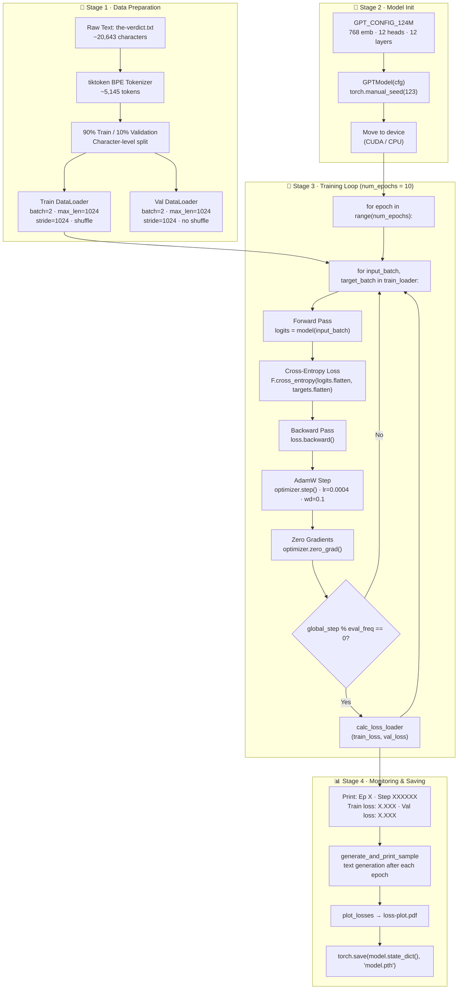
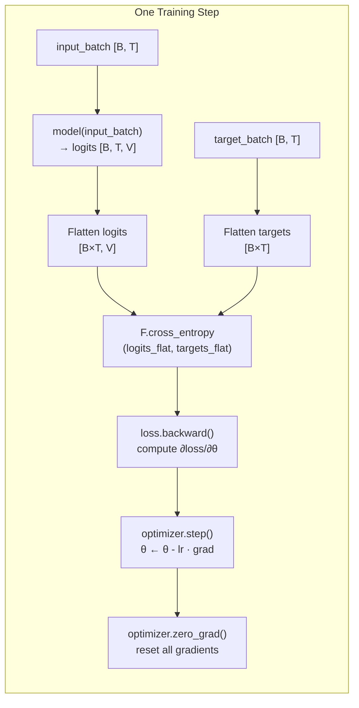
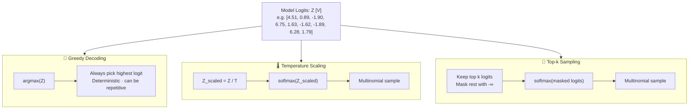
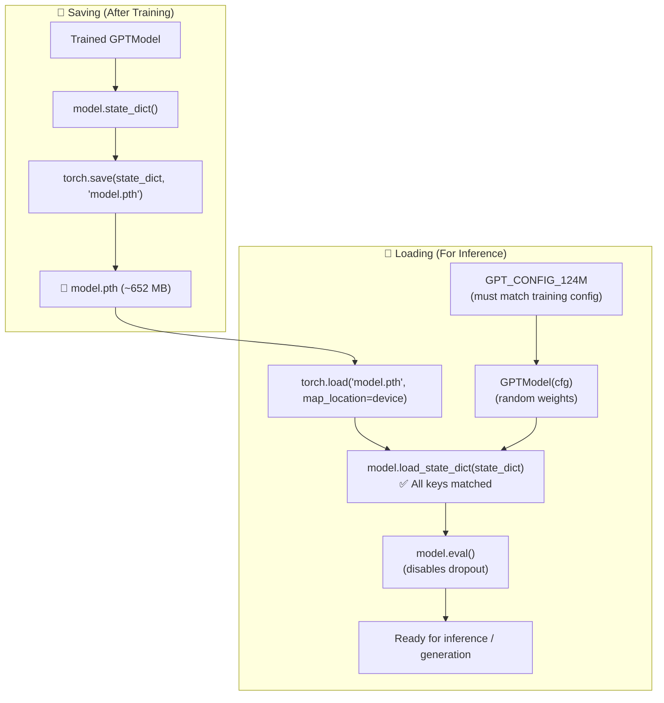
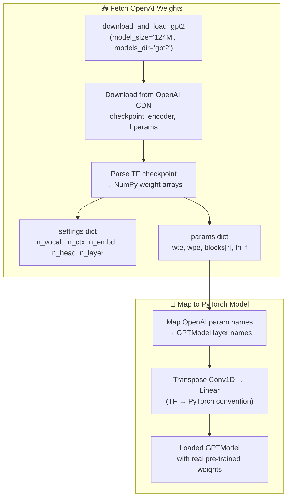

# 📊 Step 04 — Pretraining & Model Loading: Visual Workflow

> **Companion visualization for** [`Pretraining_Model.ipynb`](file:///d:/projects/LLM/04_pretraining/Pretraining_Model.ipynb), [`Pretraining_Model.md`](file:///d:/projects/LLM/04_pretraining/Pretraining_Model.md), [`Loading_a_model.ipynb`](file:///d:/projects/LLM/04_pretraining/Loading_a_model.ipynb), **and** [`Loading_a_model.md`](file:///d:/projects/LLM/04_pretraining/Loading_a_model.md)

---

## 1. End-to-End Pretraining Pipeline



---

## 2. Single Training Step Detail



---

## 3. Cross-Entropy Loss Computation

```
Model Output:
  logits [B, T, V] = [2, 4, 50257]
  ↓ flatten(0, 1)
  logits_flat [8, 50257]       ← 8 next-token predictions

Target Tokens:
  targets [B, T] = [2, 4]
  ↓ flatten()
  targets_flat [8]             ← 8 ground-truth token IDs

Cross-Entropy:
┌────────────────────────────────────────────────────────────────┐
│                                                                │
│   L = -(1/N) Σ log P(y_true | x)                              │
│                                                                │
│   where P(y=k | x) = exp(logit_k) / Σ_j exp(logit_j)         │
│                                                                │
│   Initial loss (random model): -ln(1/50257) ≈ 10.825          │
│   Trained loss target:        < 1.0                            │
│                                                                │
│   Perplexity = exp(Loss)                                       │
│     Random:  exp(10.825) ≈ 50,257  (uniform guess)            │
│     Trained: exp(0.5)    ≈ 1.65    (confident predictions)    │
│                                                                │
└────────────────────────────────────────────────────────────────┘
```

---

## 4. Loss Curve Visualization (Conceptual)

```
Loss
 ▲
11│ ●
10│  ●
 9│   ●
 8│    ●
 7│     ●
 6│      ●●
 5│        ●●              ─── Training Loss (solid)
 4│          ●●
 3│            ●●●         ─·─ Validation Loss (dashed)
 2│               ●●●●
 1│                   ●●●●●●
 0│─────────────────────────────────────▶ Epochs / Tokens Seen
  0    1    2    3    4    5    6    7    8    9   10

Dual X-Axis:
  Bottom: Epoch Number (0–10)
  Top:    Tokens Seen  (0 – ~50K)

Key Indicators:
  • Rapid initial descent (random → learning)
  • Train loss continues dropping
  • Val loss plateaus → potential overfitting signal
```

---

## 5. Decoding Strategies Comparison



---

## 6. Temperature Scaling Effect

```
Temperature T controls the "sharpness" of the probability distribution:

Vocab: [closer, every, effort, forward, inches, moves, pizza, toward, you]
Logits: [4.51,  0.89,  -1.90,  6.75,   1.63,  -1.62, -1.89,  6.28, 1.79]

┌────────────────────────────────────────────────────────────────────┐
│  T = 0.1  (Very Sharp — nearly greedy)                            │
│  ████████████████████████ forward  0.61                           │
│  ██████████████████████   toward   0.39                           │
│  ░                        all others ≈ 0.00                       │
├────────────────────────────────────────────────────────────────────┤
│  T = 0.5  (Sharp — focused sampling)                              │
│  ██████████████████       forward  0.45                           │
│  ████████████████         toward   0.38                           │
│  █████                   closer    0.12                           │
│  ░░                       others   0.05                           │
├────────────────────────────────────────────────────────────────────┤
│  T = 1.0  (Standard softmax)                                     │
│  ██████████████           forward  0.36                           │
│  ████████████             toward   0.30                           │
│  ██████                   closer   0.15                           │
│  ███                      you      0.06                           │
│  ██                       others   ~0.03 each                    │
├────────────────────────────────────────────────────────────────────┤
│  T = 2.0  (Flat — creative / diverse)                             │
│  ████████                 forward  0.19                           │
│  ███████                  toward   0.16                           │
│  ██████                   closer   0.13                           │
│  █████                    you      0.10                           │
│  ████                     every    0.09                           │
│  ████                     inches   0.09                           │
│  ███                      effort   0.08                           │
│  ███                      moves/pizza 0.08 each                  │
└────────────────────────────────────────────────────────────────────┘

Formula:  P(y_i) = exp(Z_i / T) / Σ_j exp(Z_j / T)
  T < 1  →  Sharpens distribution (more deterministic)
  T = 1  →  Standard softmax
  T > 1  →  Flattens distribution (more random/creative)
```

---

## 7. Top-k Sampling Mechanism

```
Original Logits (k = 3):
  [4.51, 0.89, -1.90, 6.75, 1.63, -1.62, -1.89, 6.28, 1.79]

Step 1: Find top-3 logits:
  top_logits = [6.75, 6.28, 4.51]   (forward, toward, closer)

Step 2: Mask everything below threshold (4.51):
  [ 4.51,  -∞,   -∞,  6.75,  -∞,   -∞,   -∞,  6.28,  -∞ ]

Step 3: Softmax over masked logits:
  [0.09,  0.00, 0.00, 0.49, 0.00, 0.00, 0.00, 0.42, 0.00]
   closer              forward                 toward

Step 4: Multinomial sample from [0.09, 0.49, 0.42]
  → Samples only from top-3 candidates
```

---

## 8. Model Checkpoint Save & Load Workflow



---

## 9. OpenAI GPT-2 Weights Loading



---

## 10. Autoregressive Text Generation Loop

```
Start:  idx = ["Every", "effort", "moves", "you"]  →  [Token IDs]  Shape: [1, 4]

┌─────────── Iteration 1 ───────────┐
│ Context:   [Every, effort, moves, you]             │
│ Logits:    model(context) → [1, 4, 50257]          │
│ Last pos:  logits[:, -1, :] → [1, 50257]           │
│ Softmax:   probabilities → [1, 50257]              │
│ Argmax:    next_token = "forward"                   │
│ Append:    [Every, effort, moves, you, forward]     │
└────────────────────────────────────┘

┌─────────── Iteration 2 ───────────┐
│ Context:   [Every, effort, moves, you, forward]     │
│ ...same process...                                  │
│ Append:    [..., forward, in]                        │
└────────────────────────────────────┘

┌─────────── Iteration N ───────────┐
│ ...repeat max_new_tokens times...                   │
└────────────────────────────────────┘

Final Output: "Every effort moves you forward in life..."
```
