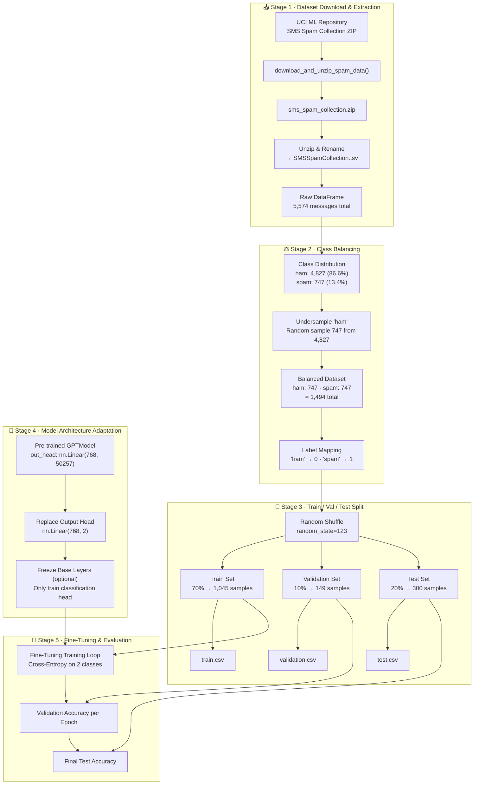
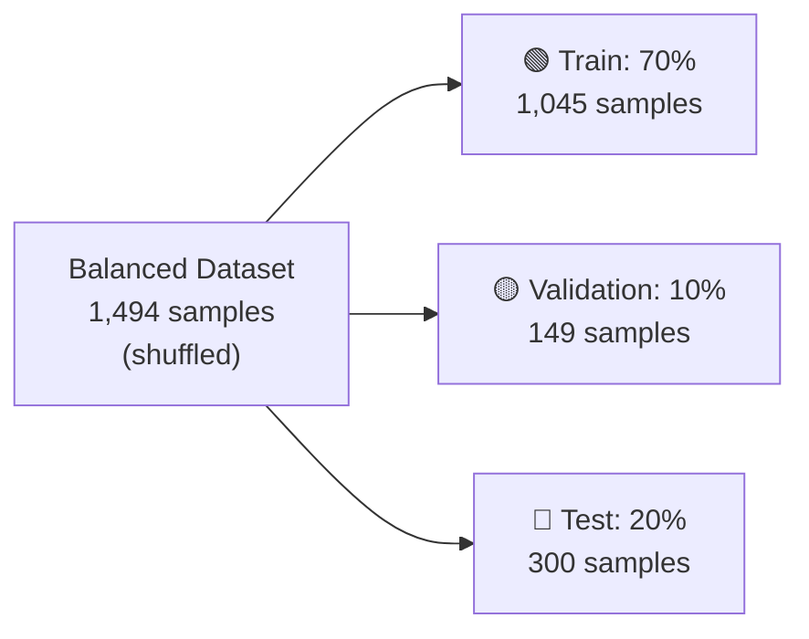
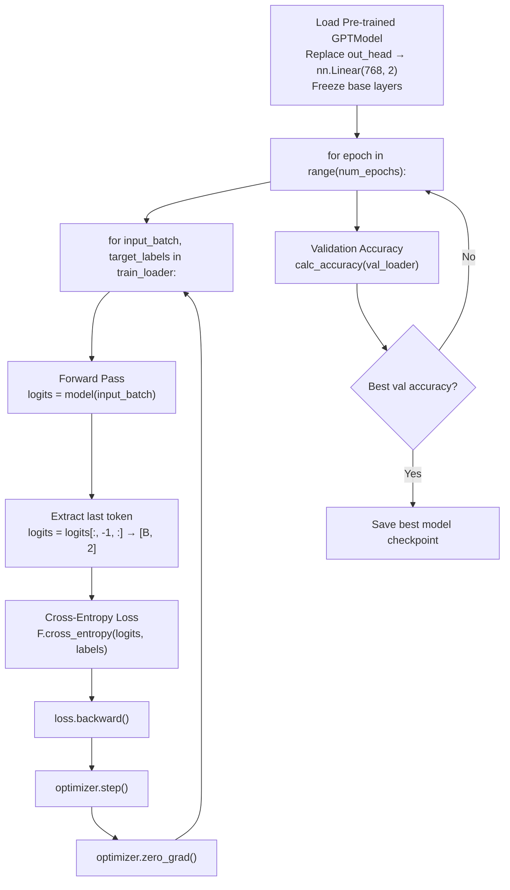

# 📊 Step 05 — Classification Finetuning: Visual Workflow

> **Companion visualization for** [`Classification_Finetuning.ipynb`](file:///d:/projects/LLM/05_finetuning/Classification_Finetuning.ipynb) **and** [`Classification_Finetuning.md`](file:///d:/projects/LLM/05_finetuning/Classification_Finetuning.md)

---

## 1. End-to-End Finetuning Pipeline



---

## 2. Class Imbalance & Balancing

```
Original Dataset Distribution:
┌─────────────────────────────────────────────────────────────┐
│                                                             │
│  ham:  ████████████████████████████████████████████ 4,827    │
│  spam: ██████                                        747    │
│                                                             │
│  Ratio: 6.5 : 1  (heavily skewed toward ham)                │
│                                                             │
└─────────────────────────────────────────────────────────────┘
                              ↓
                    Undersample majority class
                              ↓
Balanced Dataset:
┌─────────────────────────────────────────────────────────────┐
│                                                             │
│  ham:  ██████████████████████████  747                       │
│  spam: ██████████████████████████  747                       │
│                                                             │
│  Ratio: 1 : 1  (perfectly balanced)                         │
│  Total: 1,494 samples                                       │
│                                                             │
└─────────────────────────────────────────────────────────────┘
```

---

## 3. Dataset Splitting Strategy



```
Index:  0                    1045    1194       1494
        │────── Train ────────│─ Val ─│── Test ──│
        │    70% = 1,045      │ 10%   │  20%     │
        │    samples          │ =149  │  =300    │
        └─────────────────────┴───────┴──────────┘

All splits:
  • Same label ratio (≈ 50% ham, 50% spam)
  • Reproducible via random_state=123
  • Saved as CSV files: train.csv, validation.csv, test.csv
```

---

## 4. GPT Model Adaptation for Classification

```mermaid
flowchart TD
    subgraph Generative["Pre-trained GPT (Generative)"]
        G_IN["Input Token IDs\n[B, T]"]
        G_IN --> G_EMB["Embeddings + Transformer Blocks\n→ [B, T, 768]"]
        G_EMB --> G_HEAD["out_head: nn.Linear(768, 50257)\n→ [B, T, 50257]"]
        G_HEAD --> G_OUT["Next-token logits\nover entire vocabulary"]
    end

    subgraph Classifier["Fine-tuned GPT (Classifier) ✅"]
        C_IN["Input Token IDs\n[B, T]"]
        C_IN --> C_EMB["Embeddings + Transformer Blocks\n→ [B, T, 768]"]
        C_EMB --> C_LAST["Extract Last Token\nlogits[:, -1, :]\n→ [B, 768]"]
        C_LAST --> C_HEAD["NEW out_head: nn.Linear(768, 2)\n→ [B, 2]"]
        C_HEAD --> C_OUT["Binary Classification\n[P(ham), P(spam)]"]
    end

    style Classifier fill:#2d6a4f,stroke:#1b4332,color:#d8f3dc
```



---

## 5. Why Extract the Last Token?

```
Causal (Autoregressive) Self-Attention means each token can only
attend to itself and all PREVIOUS tokens:

Token positions:   t₁     t₂     t₃     t₄     t₅(last)
                   │      │      │      │      │
Attention flow:    │      │      │      │      │
                   │  ←───┤      │      │      │
                   │  ←───┤  ←───┤      │      │
                   │  ←───┤  ←───┤  ←───┤      │
                   │  ←───┤  ←───┤  ←───┤  ←───┤
                   ▼      ▼      ▼      ▼      ▼

Token t₅ (last position) has attended to ALL preceding tokens
→ Its hidden state is the richest summary of the entire sequence
→ Use logits[:, -1, :] as the sequence representation for classification
```

---

## 6. Layer Freezing Strategy

```
┌───────────────────────────────────────────────────────────┐
│           GPTModel Parameter Layers                       │
├───────────────────────────────────────────────────────────┤
│                                                           │
│  ❄️ tok_emb: nn.Embedding(50257, 768)     FROZEN          │
│  ❄️ pos_emb: nn.Embedding(1024, 768)      FROZEN          │
│  ❄️ drop_emb: nn.Dropout(0.1)             FROZEN          │
│                                                           │
│  ❄️ TransformerBlock 1                     FROZEN          │
│  ❄️ TransformerBlock 2                     FROZEN          │
│  ❄️ ...                                   FROZEN          │
│  ❄️ TransformerBlock 12                    FROZEN          │
│                                                           │
│  ❄️ final_norm: LayerNorm(768)             FROZEN          │
│                                                           │
│  ─────────────────────────────────────────────────────── │
│                                                           │
│  🔥 out_head: nn.Linear(768, 2)            TRAINABLE      │
│     ↳ 768 × 2 + 2 bias = 1,538 params                    │
│                                                           │
└───────────────────────────────────────────────────────────┘

Frozen:    ~124M params  (require_grad = False)
Trainable: ~1.5K params  (require_grad = True)

This is efficient "feature extraction" fine-tuning:
  • Base model weights are already learned from pretraining
  • Only the classification head learns task-specific mapping
  • Much faster training, less risk of catastrophic forgetting
```

---

## 7. Fine-Tuning Training Loop



---

## 8. Classification Evaluation Metrics

```
Prediction Pipeline:
┌──────────────────────────────────────────────────────────┐
│                                                          │
│  Input SMS: "Free entry in 2 a wkly comp..."             │
│       ↓                                                  │
│  Tokenize with tiktoken BPE                              │
│       ↓                                                  │
│  GPTModel forward pass                                   │
│       ↓                                                  │
│  Extract last token hidden state: [768-dim vector]       │
│       ↓                                                  │
│  Classification head: nn.Linear(768, 2) → [logit₀, logit₁]│
│       ↓                                                  │
│  argmax([logit₀, logit₁])                                │
│       ↓                                                  │
│  Prediction:  0 = ham (not spam)                         │
│               1 = spam ✉️⚠️                               │
│                                                          │
└──────────────────────────────────────────────────────────┘

Accuracy Calculation:
  correct = (predictions == true_labels).sum()
  accuracy = correct / total_samples × 100%

Evaluated on:
  • Train Set:      should be high (fitting check)
  • Validation Set: monitored during training (overfitting check)
  • Test Set:       final unseen performance metric
```

---

## 9. Complete Step 05 Summary Table

| Stage | Action | Input | Output |
|:---:|---|---|---|
| 1 | Download & Extract | UCI ZIP URL | `SMSSpamCollection.tsv` (5,574 rows) |
| 2 | Balance Classes | 4,827 ham / 747 spam | 747 ham / 747 spam (1,494 total) |
| 3 | Map Labels | `"ham"`, `"spam"` strings | `0`, `1` integers |
| 4 | Split Dataset | 1,494 shuffled rows | Train: 1,045 · Val: 149 · Test: 300 |
| 5 | Replace Head | `nn.Linear(768, 50257)` | `nn.Linear(768, 2)` |
| 6 | Freeze Layers | 124M trainable params | 1.5K trainable (head only) |
| 7 | Fine-Tune | Train set batches | Optimized classification head |
| 8 | Evaluate | Val / Test sets | Accuracy % on unseen data |
