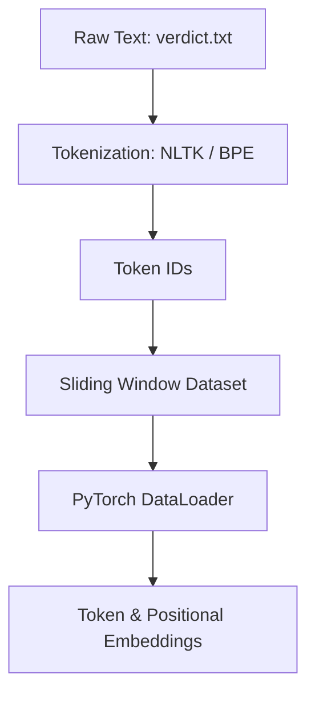

# Building an LLM from Scratch 🚀

A step-by-step, hands-on implementation of the core building blocks of a Large Language Model (LLM) from the ground up using PyTorch. This repository contains Jupyter notebooks demonstrating the data prep pipelines, custom tokenization strategies, sliding window data loaders, and various self-attention mechanisms.

---

## 📂 Repository Structure

- 📓 **[Data_Input_Pipeline.ipynb](file:///d:/projects/LLM/Data_Input_Pipeline.ipynb)**: Implements text ingestion, cleaning, tokenization, vocabulary mapping, Byte Pair Encoding (BPE), sliding window data sampling, and embedding generation.
- 📓 **[Attention_Mechanism.ipynb](file:///d:/projects/LLM/Attention_Mechanism.ipynb)**: Implements step-by-step self-attention mechanisms, starting from dot-product similarity to trainable Query-Key-Value (QKV) projections.
- 📄 **[verdict.txt](file:///d:/projects/LLM/verdict.txt)**: Raw input text (Edith Wharton's short story *The Verdict*) used to test tokenization and data loaders.
- 📋 **[requirements.txt](file:///d:/projects/LLM/requirements.txt)**: Required dependencies including PyTorch, tiktoken, NLTK, and Jupyter.

---

## 🛠️ Pipeline Details

### 1. Data Input Pipeline (`Data_Input_Pipeline.ipynb`)
Before feeding text into an LLM, it must be parsed and converted into embeddings. This notebook covers:
- **Tokenization**: Exploring basic split-by-regex methods, NLTK word tokenizers, and advanced Byte Pair Encoding (BPE) using OpenAI's `tiktoken` (GPT-2 vocabulary).
- **Special Tokens**: Handling unknown words (`<|unk|>`) and boundary markers (`<|endoftext|>`).
- **Data Sampling**: Structuring text into inputs ($x$) and targets ($y$) using a custom PyTorch `Dataset` (`GPTDatasetV1`) and a sliding window dataloader.
- **Embeddings**: Creating trainable token embedding layers (`torch.nn.Embedding`) and positional embedding layers to retain sequence order.



### 2. Attention Mechanisms (`Attention_Mechanism.ipynb`)
Attention allows models to dynamically focus on different parts of a sequence. This notebook implements:
- **Simple Self-Attention**: Calculating attention weights using dot-product similarity between raw inputs, normalized using a custom `softmax` function.
- **Matrix Operations**: Vectorizing the attention mechanism for batch compute using PyTorch matrix multiplication (tensor operations).
- **Trainable Self-Attention**: Transitioning to trainable projection matrices: Query ($W_q$), Key ($W_k$), and Value ($W_v$).

---

## ⚙️ Setup and Installation

### Prerequisites
- Python 3.10+
- PyTorch (with CUDA support if available)

### Installation
1. Clone the repository:
   ```bash
   git clone https://github.com/Neelesh2133/LLM.git
   cd LLM
   ```

2. Create a virtual environment and activate it:
   ```bash
   python -m venv .venv
   # On Windows:
   .venv\Scripts\activate
   # On macOS/Linux:
   source .venv/bin/activate
   ```

3. Install the dependencies:
   ```bash
   pip install -r requirements.txt
   ```

4. Launch Jupyter Lab to run the notebooks:
   ```bash
   jupyter lab
   ```

---

## 🧪 Quick Run Guide

Within `Data_Input_Pipeline.ipynb`, you can quickly load the sample text and verify the sliding window setup:
```python
import tiktoken
from torch.utils.data import DataLoader
from GPTDatasetV1 import GPTDatasetV1  # or defined inline

# Instantiate tokenizer and dataloader
tokenizer = tiktoken.get_encoding("gpt2")
# ... check notebooks for full execution steps
```