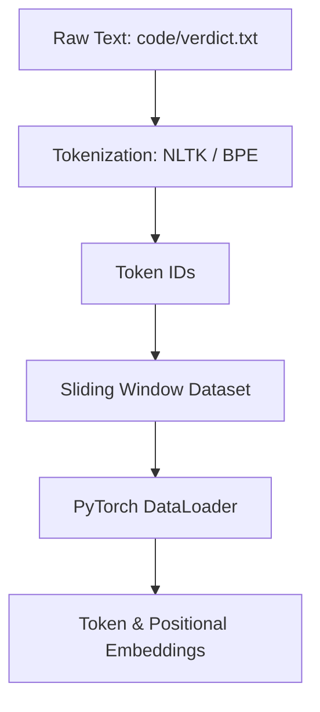

# Building an LLM from Scratch 🚀

A step-by-step, hands-on implementation of the core building blocks of a Large Language Model (LLM) from the ground up using PyTorch. This repository is organized into distinct **`code/`** and **`explanation/`** folders for clean navigation.

---

## 📂 Repository Structure

```text
LLM/
├── 💻 code/                         # Implementation Jupyter Notebooks & Data
│   ├── Attention_Mechanism.ipynb
│   ├── Data_Input_Pipeline.ipynb
│   ├── Executed_Data_Input_Pipeline.ipynb
│   └── verdict.txt
├── 📘 explanation/                  # Detailed Step-by-Step Documentation Guides
│   ├── Attention_Mechanism.md
│   ├── Data_Input_Pipeline.md
│   └── Executed_Data_Input_Pipeline.md
├── README.md                        # Project Overview & Setup Instructions
└── requirements.txt                 # Project Dependencies
```

---

## 🗂️ Notebooks & Detailed Explanations

| Component | 💻 Notebook Code | 📘 Explanation Guide | Description |
|---|---|---|---|
| **Data Input Pipeline** | [Data_Input_Pipeline.ipynb](file:///d:/projects/LLM/code/Data_Input_Pipeline.ipynb) | [Data_Input_Pipeline.md](file:///d:/projects/LLM/explanation/Data_Input_Pipeline.md) | Text reading, Regex/NLTK/BPE tokenization, sliding window dataset, and token/positional embeddings. |
| **Attention Mechanism** | [Attention_Mechanism.ipynb](file:///d:/projects/LLM/code/Attention_Mechanism.ipynb) | [Attention_Mechanism.md](file:///d:/projects/LLM/explanation/Attention_Mechanism.md) | Dot-product self-attention, matrix multiplication, trainable QKV weights, scaling factor, and PyTorch modules. |
| **Executed Pipeline Trace** | [Executed_Data_Input_Pipeline.ipynb](file:///d:/projects/LLM/code/Executed_Data_Input_Pipeline.ipynb) | [Executed_Data_Input_Pipeline.md](file:///d:/projects/LLM/explanation/Executed_Data_Input_Pipeline.md) | Execution trace, data batch shapes, token counts, and embedding verification. |

---

## 🛠️ Pipeline Overview

### 1. Data Input Pipeline ([code/Data_Input_Pipeline.ipynb](file:///d:/projects/LLM/code/Data_Input_Pipeline.ipynb))
Before feeding text into an LLM, raw text must be parsed and converted into embeddings.
- **Tokenization**: Exploring basic split-by-regex methods, NLTK word tokenizers, and Byte Pair Encoding (BPE) using OpenAI's `tiktoken` (GPT-2 vocabulary).
- **Special Tokens**: Handling unknown words (`<|unk|>`) and document boundary markers (`<|endoftext|>`).
- **Data Sampling**: Structuring text into inputs ($x$) and targets ($y$) using a custom PyTorch `Dataset` (`GPTDatasetV1`) and a sliding window dataloader.
- **Embeddings**: Creating trainable token embedding layers (`torch.nn.Embedding`) and positional embedding layers.


```mermaid
graph TD
    RawText[Raw Text: code/verdict.txt] --> Tokenizer[Tokenization: NLTK / BPE]
    Tokenizer --> TokenIDs[Token IDs]
    TokenIDs --> SlidingWindow[Sliding Window Dataset]
    SlidingWindow --> DataLoader[PyTorch DataLoader]
    DataLoader --> Embeddings[Token & Positional Embeddings]
```

### 2. Attention Mechanisms ([code/Attention_Mechanism.ipynb](file:///d:/projects/LLM/code/Attention_Mechanism.ipynb))
Attention allows models to dynamically focus on relevant tokens across sequences.
- **Simple Self-Attention**: Calculating attention weights using dot-product similarity between raw inputs.
- **Matrix Operations**: Vectorizing the attention mechanism using PyTorch tensor multiplication.
- **Trainable QKV Weights**: Transitioning to trainable Query ($W_q$), Key ($W_k$), and Value ($W_v$) weight projections.
- **PyTorch Modules**: Modular encapsulation into `SelfAttention_v1` (`nn.Parameter`) and `SelfAttention_v2` (`nn.Linear`).

---

## ⚙️ Setup and Installation

### Prerequisites
- Python 3.10+
- PyTorch (with CUDA support if available)

### Installation
1. Clone the repository:
   ```bash
   git clone https://github.com/Neelesh2133/LLM.git
   cd LLM
   ```

2. Create a virtual environment and activate it:
   ```bash
   python -m venv .venv
   # On Windows:
   .venv\Scripts\activate
   # On macOS/Linux:
   source .venv/bin/activate
   ```

3. Install the dependencies:
   ```bash
   pip install -r requirements.txt
   ```

4. Launch Jupyter Lab to run notebooks from the `code/` folder:
   ```bash
   jupyter lab
   ```