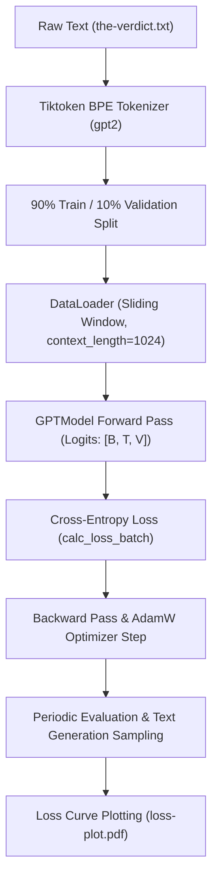

# Pretraining LLM Architecture & Pipeline (`Pretraining_Model.ipynb`)

This document provides a comprehensive, step-by-step breakdown of **`code/Pretraining_Model.ipynb`** ([notebook link](file:///d:/projects/LLM/code/Pretraining_Model.ipynb)). It covers the mathematical concepts, loss metrics, dataloader splitting, training loop implementation, loss visualization, and decoding strategies required to pretrain a Generative Pre-trained Transformer (GPT) model from scratch on raw text data using PyTorch.

---

## 📌 Pretraining Pipeline Overview

Pretraining is the first stage in training Large Language Models (LLMs). The model is trained in a self-supervised manner using **Causal Language Modeling (Next-Token Prediction)**: given a sequence of tokens, the model learns to predict the next token in the sequence.



---

## 1. Text Generation Baseline & Initial Setup

Before training, the model is initialized with random weights to establish a baseline for loss calculation and text generation.

### Model Initialization & Configuration
The model uses the `GPT_CONFIG_124M` architecture defined in [gpt_model.py](file:///d:/projects/LLM/code/gpt_model.py):

```python
from gpt_model import GPTModel

GPT_CONFIG_124M = {
    "vocab_size": 50257,      # Vocabulary size (BPE tokens)
    "context_length": 1024,   # Context window size
    "emb_dim": 768,           # Embedding dimension
    "n_heads": 12,            # Multi-head attention heads
    "n_layers": 12,           # Transformer layers
    "drop_rate": 0.1,         # Dropout rate
    "qkv_bias": False         # Query-Key-Value bias flag
}

torch.manual_seed(123)
model = GPTModel(GPT_CONFIG_124M)
model.eval()
```

### Tokenization Utilities

Two utility functions convert raw text strings to PyTorch tensors of token IDs and back:

```python
import tiktoken
tokenizer = tiktoken.get_encoding("gpt2")

def text_to_token_ids(text, tokenizer):
    encoded = tokenizer.encode(text, allowed_special={"<|endoftext|>"})
    return torch.tensor(encoded).unsqueeze(0)  # Shape: [1, seq_len]

def token_ids_to_text(token_ids, tokenizer):
    flat = token_ids.squeeze(0)  # Remove batch dimension
    return tokenizer.decode(flat.tolist())
```

### Untrained Model Generation Baseline

Generating text from an untrained model with `generate_text_simple` results in incoherent output due to randomly initialized weights:

```python
start_context = "Hello world , LLM"
token_ids = generate_text_simple(
    model=model,
    idx=text_to_token_ids(start_context, tokenizer),
    max_new_tokens=10,
    context_size=GPT_CONFIG_124M["context_length"]
)
print(token_ids_to_text(token_ids, tokenizer))
```

---

## 2. Loss Evaluation Mechanics: Cross-Entropy & Perplexity

To measure how well the model predicts next tokens, we compute **Cross-Entropy Loss** and **Perplexity**.

### Mathematical Formulation

Given logits $Z \in \mathbb{R}^{B \times T \times V}$ output by the model and target token IDs $Y \in \mathbb{R}^{B \times T}$:

1. **Probability Distribution (Softmax)**:
   $$P(y_{i,t} = k | x) = \text{softmax}(Z_{i,t})_k = \frac{\exp(Z_{i,t,k})}{\sum_{j=1}^{V} \exp(Z_{i,t,j})}$$

2. **Cross-Entropy Loss**:
   $$\mathcal{L} = -\frac{1}{N} \sum_{n=1}^{N} \log P(y_n | x_n)$$

3. **Perplexity**:
   $$\text{Perplexity} = e^{\mathcal{L}}$$
   Perplexity measures the effective uncertainty of the model when predicting the next token. A lower perplexity indicates higher model confidence.

### Step-by-Step Loss Calculation Code

```python
# Example batch: 2 sequences, 3 input tokens each
inputs = torch.tensor([
    [16833, 3626, 6100],  # "every effort moves"
    [40, 1107, 588]       # "I really like"
])

# Shifted target tokens (next token prediction)
targets = torch.tensor([
    [3626, 6100, 345],    # " effort moves you"
    [1107, 588, 11311]    # " really like chocolate"
])

# 1. Forward pass
with torch.no_grad():
    logits = model(inputs)  # Shape: [2, 3, 50257]

# 2. Compute probabilities
prob = torch.softmax(logits, dim=-1)

# 3. Flatten for cross-entropy function
logits_flatten = logits.flatten(0, 1)   # Shape: [6, 50257]
targets_flatten = targets.flatten()     # Shape: [6]

# 4. Cross-entropy loss
loss = torch.nn.functional.cross_entropy(logits_flatten, targets_flatten)
```

### Initial Theoretical Baseline Loss
For a randomly initialized model, initial cross-entropy loss approximates uniform probability distribution over the vocabulary size $V = 50,257$:

$$\mathcal{L}_{\text{initial}} \approx -\ln\left(\frac{1}{V}\right) = \ln(50257) \approx 10.825$$

---

## 3. Pretraining Dataset Preparation & DataLoader

Pretraining requires structured sliding-window input and target sequence pairs created from raw text data.

### Dataset Tokenization & Splitting

Using Edith Wharton's short story *The Verdict* (`the-verdict.txt`):

- **Total Characters**: ~20,643
- **Total BPE Tokens**: ~5,145
- **Train/Val Split**: 90% Training data, 10% Validation data

```python
with open("the-verdict.txt", "r", encoding="utf-8") as f:
    text_data = f.read()

train_ratio = 0.90
split_idx = int(train_ratio * len(text_data))
train_data = text_data[:split_idx]
val_data = text_data[split_idx:]
```

### Dataloader Instantiation

```python
train_loader = create_dataloader_v1(
    train_data,
    batch_size=2,
    max_length=GPT_CONFIG_124M["context_length"],
    stride=GPT_CONFIG_124M["context_length"],
    drop_last=True,
    shuffle=True,
    num_workers=0
)

val_loader = create_dataloader_v1(
    val_data,
    batch_size=2,
    max_length=GPT_CONFIG_124M["context_length"],
    stride=GPT_CONFIG_124M["context_length"],
    drop_last=False,
    shuffle=False,
    num_workers=0
)
```

---

## 4. Loss Evaluation Functions

To track model convergence during training without altering weights, evaluation functions process batches with gradient tracking disabled (`torch.no_grad()`).

### `calc_loss_batch` & `calc_loss_loader`

```python
def calc_loss_batch(input_batch, target_batch, model, device):
    input_batch, target_batch = input_batch.to(device), target_batch.to(device)
    logits = model(input_batch)
    loss = torch.nn.functional.cross_entropy(
        logits.flatten(0, 1), target_batch.flatten()
    )
    return loss

def calc_loss_loader(data_loader, model, device, num_batches=None):
    total_loss = 0.0
    if len(data_loader) == 0:
        return float("nan")
    elif num_batches is None:
        num_batches = len(data_loader)
    else:
        num_batches = min(num_batches, len(data_loader))
        
    for i, (input_batch, target_batch) in enumerate(data_loader):
        if i < num_batches:
            loss = calc_loss_batch(input_batch, target_batch, model, device)
            total_loss += loss.item()
        else:
            break
    return total_loss / num_batches
```

---

## 5. Main Pretraining Loop Implementation (`train_model_simple`)

The core training function iterates through specified training epochs, executes gradient updates via AdamW optimizer, periodically evaluates loss, and generates sample text outputs.

### Training Loop Architecture

```python
def train_model_simple(model, train_loader, val_loader, optimizer, device, num_epochs,
                       eval_freq, eval_iter, start_context, tokenizer):
    train_losses, val_losses, track_tokens_seen = [], [], []
    tokens_seen, global_step = 0, -1

    for epoch in range(num_epochs):
        model.train()  # Enable training mode (dropout active)
        
        for input_batch, target_batch in train_loader:
            optimizer.zero_grad()  # 1. Reset gradients
            loss = calc_loss_batch(input_batch, target_batch, model, device)  # 2. Compute loss
            loss.backward()        # 3. Backward pass (compute gradients)
            optimizer.step()       # 4. Update model parameters
            
            tokens_seen += input_batch.numel()
            global_step += 1

            # Periodic loss evaluation
            if global_step % eval_freq == 0:
                train_loss, val_loss = evaluate_model(
                    model, train_loader, val_loader, device, eval_iter
                )
                train_losses.append(train_loss)
                val_losses.append(val_loss)
                track_tokens_seen.append(tokens_seen)
                print(f"Ep {epoch+1} (Step {global_step:06d}): "
                      f"Train loss {train_loss:.3f}, Val loss {val_loss:.3f}")

        # Generate sample text after each epoch
        generate_and_print_sample(model, tokenizer, device, start_context)

    return train_losses, val_losses, track_tokens_seen
```

### Supporting Helper Functions

```python
def evaluate_model(model, train_loader, val_loader, device, eval_iter):
    model.eval()
    with torch.no_grad():
        train_loss = calc_loss_loader(train_loader, model, device, num_batches=eval_iter)
        val_loss = calc_loss_loader(val_loader, model, device, num_batches=eval_iter)
    model.train()
    return train_loss, val_loss

def generate_and_print_sample(model, tokenizer, device, start_context):
    model.eval()
    context_size = model.pos_emb.weight.shape[0]
    encoded = text_to_token_ids(start_context, tokenizer).to(device)
    with torch.no_grad():
        token_ids = generate_text_simple(
            model=model, idx=encoded,
            max_new_tokens=50, context_size=context_size
        )
    decoded_text = token_ids_to_text(token_ids, tokenizer)
    print(decoded_text.replace("\n", " "))
    model.train()
```

### Running Model Pretraining

```python
device = torch.device("cuda" if torch.cuda.is_available() else "cpu")

torch.manual_seed(123)
model = GPTModel(GPT_CONFIG_124M).to(device)
optimizer = torch.optim.AdamW(model.parameters(), lr=0.0004, weight_decay=0.1)

num_epochs = 10
train_losses, val_losses, tokens_seen = train_model_simple(
    model=model,
    train_loader=train_loader,
    val_loader=val_loader,
    optimizer=optimizer,
    device=device,
    num_epochs=num_epochs,
    eval_freq=5,
    eval_iter=5,
    start_context="Every effort moves you",
    tokenizer=tokenizer
)
```

---

## 6. Training Progress & Loss Visualization

To monitor model learning dynamics and check for overfitting, training and validation loss curves are plotted against epochs and tokens seen:

```python
import matplotlib.pyplot as plt
from matplotlib.ticker import MaxNLocator

def plot_losses(epochs_seen, tokens_seen, train_losses, val_losses):
    fig, ax1 = plt.subplots(figsize=(6, 4))

    # Primary x-axis: Epochs
    ax1.plot(epochs_seen, train_losses, label="Training loss")
    ax1.plot(epochs_seen, val_losses, linestyle="-.", label="Validation loss")
    ax1.set_xlabel("Epochs")
    ax1.set_ylabel("Loss")
    ax1.legend(loc="upper right")
    ax1.xaxis.set_major_locator(MaxNLocator(integer=True))

    # Secondary x-axis: Tokens seen
    ax2 = ax1.twiny()
    ax2.plot(tokens_seen, train_losses, alpha=0)  # Invisible plot line for alignment
    ax2.set_xlabel("Tokens seen")

    fig.tight_layout()
    plt.savefig("loss-plot.pdf")
    plt.show()

epochs_tensor = torch.linspace(0, num_epochs, len(train_losses))
plot_losses(epochs_tensor, tokens_seen, train_losses, val_losses)
```

---

## 7. Decoding Strategies & Temperature Scaling

After pretraining, greedy decoding (always picking $\text{argmax}(\text{logits})$) can cause repetitive text generation. Advanced decoding techniques modify the probability distribution over vocabulary tokens using **Temperature Scaling**.

### Mathematical Formulation of Temperature Scaling

Given logit vector $Z$:

$$P(y_i) = \text{softmax}\left(\frac{Z}{T}\right)_i = \frac{\exp(Z_i / T)}{\sum_j \exp(Z_j / T)}$$

- **$T = 1.0$**: Standard Softmax probability distribution.
- **$T < 1.0$ (e.g. 0.5)**: Sharpens distribution, increasing probability of high-confidence tokens (more deterministic).
- **$T > 1.0$ (e.g. 2.0)**: Flattens distribution, increasing probability of lower-ranked tokens (more creative / random).

### Python Implementation & Temperature Visualization (`temperature-plot.pdf`)

```python
vocab = {
    "closer": 0, "every": 1, "effort": 2, "forward": 3,
    "inches": 4, "moves": 5, "pizza": 6, "toward": 7, "you": 8
}
inverse_vocab = {v: k for k, v in vocab.items()}

# Example next-token logits output by LLM
next_token_logits = torch.tensor([4.51, 0.89, -1.90, 6.75, 1.63, -1.62, -1.89, 6.28, 1.79])

# Calculate temperature-scaled softmax distributions
temperatures = [0.1, 0.5, 1.0, 2.0]
scaled_probas = [torch.softmax(next_token_logits / T, dim=-1) for T in temperatures]

# Plotting bar chart comparison across temperatures
x = torch.arange(len(vocab))
bar_width = 0.15
fig, ax = plt.subplots(figsize=(6, 3.5))

for i, T in enumerate(temperatures):
    ax.bar(x + i * bar_width, scaled_probas[i], bar_width, label=f'Temperature = {T}')

ax.set_ylabel('Probability')
ax.set_xticks(x + bar_width * 1.5)
ax.set_xticklabels(vocab.keys(), rotation=45)
ax.legend()
plt.tight_layout()
plt.savefig("temperature-plot.pdf")
plt.show()
```


---

## 🔑 Key Summary Takeaways

| Metric / Concept | Value / Implementation | Description |
|---|---|---|
| **Model Configuration** | `GPT_CONFIG_124M` | 124M parameter GPT architecture (768 embedding size, 12 layers, 12 heads). |
| **Initial Loss** | $\approx 10.825$ | Uniform distribution $-\ln(1 / 50257)$ cross-entropy baseline. |
| **Optimizer** | `AdamW(lr=0.0004, weight_decay=0.1)` | Adaptive optimizer with weight decay regularization. |
| **Context Length** | `1024 tokens` | Max context sequence window processed per forward step. |
| **Loss Metric** | `torch.nn.functional.cross_entropy` | Flattened batch cross-entropy over tokens. |
| **Evaluation Metric** | `Perplexity = exp(Loss)` | Exponential of cross-entropy loss measuring vocabulary choice uncertainty. |
